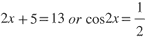
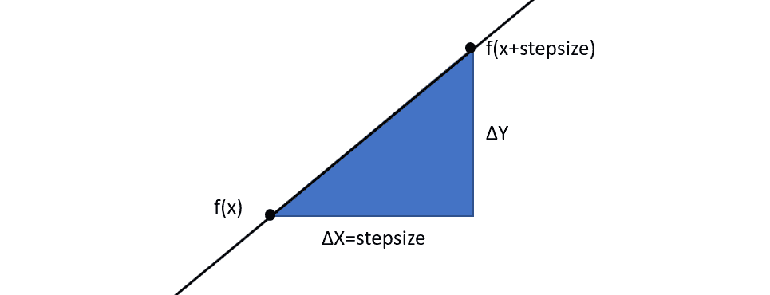
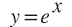
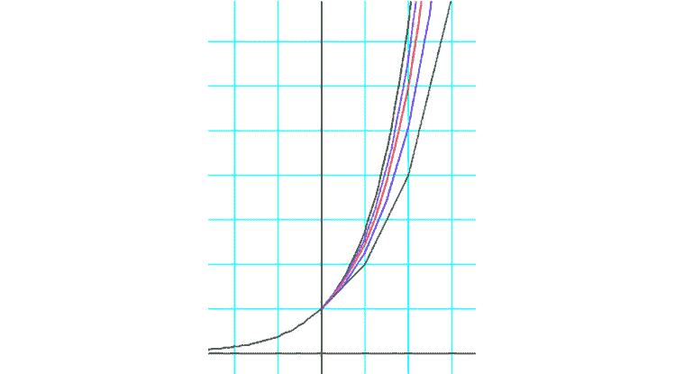
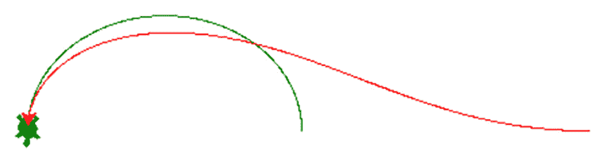
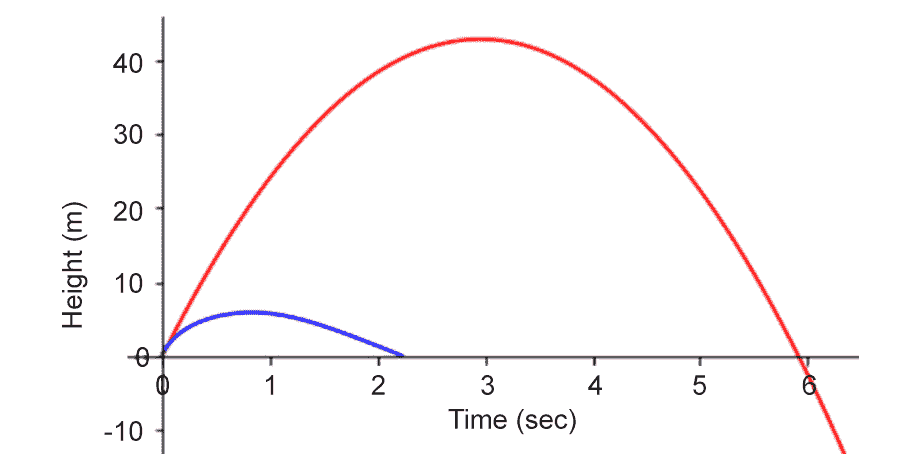

# 12Python 中级微积分

概述

到本章结束时，您将能够解决给定的关于变量变化的方程的问题。在本章中，您将使用数值方法对人口和温度进行建模，并使用微分方程计算其过去值或预测其未来值。您将学习如何使用二进制搜索来*猜测和检查*当您知道答案在特定的数字范围内时，您将获得非常精确的答案。您还将对对象移动的情况进行建模，并在给定其速度的微分方程时求解其未来位置。

# 导言

数学专业的学生经常抱怨说，在代数和几何中出现的各种问题，例如多项式的因式分解或等分角，没有实际的应用，但微分方程却不是这样。使用这些工具，您将在本章中学习，您将能够使用微分方程建模和解决物理、电子和工程中的实际问题。Python 是数学家和科学家的完美工具，他们希望能够处理数字和解决问题，但又不想获得计算机科学的另一个学位。Python 是最流行的编程语言之一，因为它易于使用，并且没有不必要的抽象。

到了 17 世纪，数学家们已经用数学方程式模拟了下落物体的运动，并将目光投向了外层空间的行星。牛顿为他们的运动建模，他提出的方程不仅涉及未知数字，而且还涉及这些数字的变化。例如，他的方程式不仅包含未知的角度，还包含该角度的变化（其角速度）甚至角度的变化（其加速度）！没有解这些方程的工具，所以他不得不自己发明这些工具。这些工具被称为微积分。

# 微分方程

在数学课上解一个方程通常涉及一个未知的数字，*x*。该公式隐藏了该值，但为您提供了如何找到该值的提示，例如。但是要解一个微分方程，你只需要得到关于函数导数的信息，你需要找到函数。可以是以下简单的事情：


图 12.1：寻找具有导数 2 的函数

这意味着*找到一个导数为 2 的函数。*也可以这样写：


图 12.2：表示函数导数的替代方法

通过简单的积分，我们可以找到在这个方程中起作用的函数，因为我们知道函数*y=2x*有一个 2 的导数。事实上，许多相关函数，如*y=2x+1*、*y=2x+2*、*y=2x+3*等，都有 2 的导数。所以，我们写了一个一般形式，就是，*y=2x+C*。

当我们没有太多事情要做时，事情会变得更加复杂，就像下面的等式：


图 12.3：值为函数本身的函数的导数

这是要求一个函数，其导数是函数本身。

为了理解微分方程是如何使用的，让我们从简单的函数开始，这些函数涉及现实世界中的事物，比如金钱。

# 利息计算

在微分方程的研究中有一个重要的工具，它起源于中世纪的利息计算研究。让我们来看看下面的练习。

## 练习 12.01：计算利息

储蓄账户每年支付 2%的利息。如果投资 3500 美元，5 年后账户中有多少钱？

单利的计算公式如下：


图 12.4：单利公式

这里，*I*是利息，*P*是本金或原始投资金额，*r*是利率或增长率，*t*是金额投资的时间。根据该公式，该金额的利息为*I=（3500）（0.02）（5）=350 美元*。按照以下步骤完成此练习：

1.  这是一个启动一个程序的好机会，该程序将获取初始金额、利率和时间，并使用前面的公式输出所赚取的利息：

    ```py
    def amount(p0,rate,t):
        """Returns the amount after t
        years starting at p0 and growing
        at the given rate per year"""
        return p0*rate*t
    ```

2.  As you can see in the docstring of the `amount` function, it will take a starting amount and a rate of growth and return the amount of the investment after the given number of years. Let's see the interest earned in 1-5 years:

    ```py
    for i in range(1,6):
        print(i,amount(3500,0.02,i))
    ```

    以下是输出：

    ```py
    1 70.0
    2 140.0
    3 210.0
    4 280.0
    5 350.0
    ```

    但这并不是真正意义上的兴趣。每年有几次，我们计算当年那一部分的利息，加上本金，新本金就会更高。下一次利息计算是在较高的数字上，因此名称为*复利*。考虑到*n*每年的复利，*t*年后的金额公式如下：

    

    图 12.5：计算 t 年后金额的公式

3.  Let's change our `amount` function to the following:

    ```py
    def amount(p0,rate,t,comps):
        """Returns the amount after t
        years starting at p0 and growing
        at the given rate per year
        compounded comps times per year"""
        for i in range(int(t*comps)):
            p0 += p0*rate/comps
        return p0
    ```

    在这个函数中，我们将获得的利息添加到由复利数量给出的年份分数中。如果我们每年只复利一次，它看起来是这样的：

    ```py
    for i in range(1,6):
        print(i,amount(3500,0.02,i,1))
    ```

    这就是我们得到的：

    ```py
    1 3570.0
    2 3641.4
    3 3714.228
    4 3788.51256
    5 3864.2828112
    ```

因此，5 年后，我们赚了 364 美元，而不仅仅是 350 美元。更频繁地复利，即使利率相同，也会使金额增长更快。如果我们将复利改为每年 12 美元（每月复利），5 年后我们会得到 3867 美元，比每年复利多一点。

笔记

要访问此特定部分的源代码，请参考[https://packt.live/3dUWz7C.](https://packt.live/3dUWz7C )

您也可以在[在线运行此示例 https://packt.live/3iqUKCO.](https://packt.live/3iqUKCO )

## 练习 12.02：计算复利——第 1 部分

2000 美元投资于一个储蓄账户，年利率为 5.5%，按月复利。这一数额增长到 8000 美元需要多长时间？请按照以下步骤进行操作：

1.  We'll print out the first 5 years of the investment using our `amount` function from the previous exercise:

    ```py
    for i in range(1,6):
        print(i,amount(2000,0.055,i,12))
    ```

    结果如下：

    ```py
    1 2112.815720771071
    2 2231.9951349686903
    3 2357.8972049231984
    4 2490.9011412619493
    5 2631.4075450724245
    ```

2.  After 5 years, the amount is only $2,631\. To get to $8,000, we'll have to go to 20 or 30 years:

    ```py
    for i in [5,10,15,20,25,30]:
        print(i,amount(2000,0.055,i,12))
    ```

    输出如下：

    ```py
    5 2631.4075450724245
    10 3462.1528341320413
    15 4555.167544964467
    20 5993.251123444263
    25 7885.343112872511
    30 10374.775681348801
    ```

    25 年到 30 年的某个时候，我们将得到 8000 美元。更准确的方法是更聪明地猜测。

3.  We'll cut the range in half and guess higher or lower based on what we get out. For example, the average of 25 and 30 years is 27.5, so we enter the following:

    ```py
    print(amount(2000,0.055,27.5,12))
    ```

    以下是输出：

    ```py
    9044.814313545687
    ```

    因此，我们将在 27.5 年内达到 9000 美元。达到 8000 美元的时间必须少于这个数字。

4.  We'll calculate the average of 25 and 27.5 and plug that in:

    ```py
    def average(a,b):
        return (a+b)/2
    print(amount(2000,0.055,average(25,27.5),12))
    ```

    以下是输出：

    ```py
    8445.203624219383
    ```

5.  让我们编写一个程序，在找到答案之前一直这样做。这称为**二进制搜索**。让我们创建一个`bin_search`函数，该函数将使用我们正在使用的函数的名称、我们正在搜索的范围的上下限以及本例中的目标输出 8000 作为参数：

    ```py
    def bin_search(f,lower,upper,target):
        for i in range(20):
            avg = average(lower,upper)
    ```

6.  这是关键线。它使用所有其他所需参数将平均值插入函数，并将输出分配给`guess`变量。我们将检查该变量是否等于我们的目标值，或者我们是否必须猜测更高或更低的值：

    ```py
            guess = f(2000,0.055,avg,12)
            if guess == target:
                return guess
            if guess > target:
                upper = avg
            else:
                lower = avg
        return avg
    ```

7.  We'll plug the lower and higher ends of our range into our function, as well as our target number, to get our approximation:

    ```py
    bin_search(amount,25,30,8000)
    ```

    结果如下：

    ```py
    25.333333015441895
    ```

8.  Looks like we'll get to $8,000 in **25 years and 4 months**. Let's check that:

    ```py
    amount(2000,0.055,25.334,12)
    ```

    果不其然，复利后的余额刚刚超过 8000 美元：

    ```py
    8030.904658737448
    ```

我们将再次使用二进制搜索，但现在，让我们使用我们的代码来查找微分方程中经常出现的一个相当重要的数学常数。

笔记

要访问此特定部分的源代码，请参考[https://packt.live/3iq95PV.](https://packt.live/3iq95PV )

您也可以在[在线运行此示例 https://packt.live/2BpdbHI.](https://packt.live/2BpdbHI )

## 练习 12.03：计算复利–第 2 部分

如果你以 100%的利息投资 1 美元，连续复利 1 年，你会赚多少？

记住，复利的频率越高，最终金额就越高。你认为要多少钱$1.50? $2.本金、利率和时间都是 1，但`comps`变量是什么？按照以下步骤完成此练习：

1.  To approximate compounding continuously, we'll compound the interest every second (*365*24*60*60* times per year):

    ```py
    print(amount(1,1,1,365*24*60*60))
    ```

    结果如下：

    ```py
    2.7182817853606362
    ```

    这大约是 2.72 美元。这个数字，2.71828…，是数字*e*，它是自然对数的基数。这对于模拟自然界中的种群非常有用，因为动物、植物和微生物不会等到月底才连续繁殖。因此，当利息持续复合或人口自然增长时，我们将使用以下公式：

    

    图 12.6：计算复利的公式

2.  让我们创建一个函数来快速执行此操作。首先，我们需要从`math`模块中导入*e*用于我们的连续配制：

    ```py
    from math import e
    ```

3.  创建一个`pert`函数，插入初始数量或人口、增长率和时间，并返回最终数量：

    ```py
    def pert(P,r,t):
        return P*e**(r*t)
    ```

在本章中，我们将返回此函数。现在，让我们回答更多的投资问题。

笔记

要访问此特定部分的源代码，请参考[https://packt.live/2D2Q1r0\.](https://packt.live/2D2Q1r0 )

您也可以在[在线运行此示例 https://packt.live/31G5pDQ.](https://packt.live/31G5pDQ )

## 练习 12.04：计算复利–第 3 部分

一个人以 18%的年利率每月复利借入 5000 美元。一年后该人将欠多少钱？按照以下步骤完成此练习：

1.  We can just put it into our function call:

    ```py
    amount(5000,0.18,1,12)
    ```

    结果如下：

    ```py
    5978.090857307678
    ```

    为了进行比较，让我们看看如果利息持续复利会发生什么。

2.  We'll use our `pert` function to input `P = 5000`, `r = 0.18`, and `t = 1` as values:

    ```py
    print("Continuous:",pert(5000,0.18,1))
    ```

    由此产生的数额如下：

    ```py
    5986.096815609051
    ```

    笔记

    要访问此特定部分的源代码，请参考[https://packt.live/31ES5Qi.](https://packt.live/31ES5Qi )

    您也可以在[在线运行此示例 https://packt.live/3f5j0s4\.](https://packt.live/3f5j0s4 )

## 练习 12.05：成为百万富翁

如果你以 8%的年利率每天复利投资 1000 美元，你要多久才能成为百万富翁？如果最初的金额是 10000 美元呢？按照以下步骤完成此练习：

1.  首先，让我们定义`bin_search`函数，如下所示：

    ```py
    def bin_search(f,lower,upper,target):
        for i in range(20):
            avg = average(lower,upper)
            #Be sure to change this line
            #if the principal, rate or
            #compounding changes:
            guess = f(1000,0.08,avg,365)
            if guess == target:
                return guess
            if guess > target:
                upper = avg
            else:
                lower = avg
        return avg
    ```

2.  Let's take some wild guesses and see what we would get if the $1,000 were invested for these numbers of years:

    ```py
    for i in [10,20,30,40,50]:
        print(i,amount(1000,0.08,i,365))
    ```

    以下是输出：

    ```py
    10 2225.34584963113
    20 4952.164150470476
    30 11020.277938941583
    40 24523.929773205105
    50 54574.22533744746
    ```

3.  After 50 years, you still would only have $54,000, not a million. But after 100 years, you'd have almost 3 million:

    ```py
    amount(1000,0.08,100,365)
    ```

    以下是输出：

    ```py
    2978346.0711824815
    ```

4.  The answer must be somewhere between 50 and 100\. Looks like a job for our binary search:

    ```py
    print(bin_search(amount,50,100,1000000))
    ```

    我们得到这个输出：

    ```py
    86.3588809967041
    ```

5.  This shows that after 86.36 years, we'll have 1 million dollars. If the initial investment is $10,000, then update the `guess` variable in the `bin_search` function:

    ```py
            guess = f(10000,0.08,avg,365)
    ```

    下面是我们将如何打印出所需的输出：

    ```py
    for i in [10,15,20,30,40,50,60]:
        print(i,amount(10000,0.08,i,365))
    ```

    结果如下：

    ```py
    10 22253.458496311334
    15 33196.803971077774
    20 49521.64150470513
    30 110202.77938941623
    40 245239.2977320514
    50 545742.2533744735
    60 1214465.2585152255
    ```

6.  So, we reach 1 million dollars in somewhere between 50 and 60 years. Let's change `1000` to `10000` in our binary search function and check it:

    ```py
    print(bin_search(amount,50,60,1000000))
    ```

    我们得到这个输出：

    ```py
    57.57260322570801
    ```

刚过 57.57 年就达到了一百万美元。

所以，我们从研究复利开始学习微分方程。最初的一笔钱每隔一年、一个月或一天就有一个利率。

笔记

要访问此特定部分的源代码，请参考[https://packt.live/31ycoPg.](https://packt.live/31ycoPg )

您也可以在[在线运行此示例 https://packt.live/2NMT9sX.](https://packt.live/2NMT9sX )

现在，我们将同样的推理扩展到不断变化的人、动物、细菌和热量的数量，或者说持续变化的数量。

# 人口增长

微分方程有助于找到特定时间的人口、动物和细菌的公式；例如：


图 12.7：计算 t 时总体的微分方程

这个微分方程意味着*y*的变化率与*y*成正比，或者种群增长与其数量成正比。这就是人口增长率的定义：人口的一小部分或百分比。解决方案类似于我们涉及连续复利的利息问题：


图 12.8：计算变化率的微分方程

## 练习 12.06：计算人口增长率——第 1 部分

20 世纪 80 年代，肯尼亚的年人口增长率为 4%。按照这个速度，人口翻番需要多长时间？按照以下步骤完成此练习：

1.  无论起始人口是多少，我们都在寻找*t*，这使得因子*e*rt 等于 2。我们可以使用`pert`函数和二项式搜索函数，只需稍加调整：

    ```py
    def bin_search(f,lower,upper,target):
        for i in range(40):
            avg = average(lower,upper)
            guess = f(1,0.04,avg)
            if guess == target:
                return guess
            if guess > target:
                upper = avg
            else:
                lower = avg
        return avg
    ```

2.  We're looking for the time, *t*, that will, with a growth rate of 4%, turn our initial population of 1 into 2\. We estimate it will be somewhere between 1 and 100 years:

    ```py
    print(bin_search(pert,1,100,2))
    ```

    结果如下：

    ```py
    17.32867951408025
    ```

    我们可以用代数来检验。取方程两边的对数，解*t*：

    

    图 12.9：求解时间（t）的方程

3.  This means that in just over 17 years, the population of Kenya will have doubled. We can check this with our `amount` function. In 1989, the population of Kenya was 21,000,000:

    ```py
    print(amount(21000000,0.04,17.3,1000000))
    ```

    以下是输出：

    ```py
    41951845.46179989
    ```

是的，每年使用一百万种成分，人口在 17.3 年内增长到将近 4200 万。

对此，肯尼亚政府大力推动*计划生育*。它起作用了吗？

笔记

要访问此特定部分的源代码，请参考[https://packt.live/2BxsfCT.](https://packt.live/2BxsfCT )

您也可以在[在线运行此示例 https://packt.live/2Zuoy9c.](https://packt.live/2Zuoy9c )

## 练习 12.07：计算人口增长率——第 2 部分

2010 年，肯尼亚人口为 4200 万。2019 年，这一数字为 5250 万。该范围内每年的人口增长率是多少？

同样，我们可以使用二进制搜索函数返回一个生长因子*r*，给定初始人口（百万）、时间*t*以及 9 年后的目标人口（百万）。

在`bin_search`功能中，将时间更改为`9`：

```py
        guess = f(1,avg,9)
```

然后，我们会找到这 9 年的年增长率。我们知道它介于 0 和 2 之间：

```py
print(bin_search(pert,0,2,52.5/42))
```

打印的值如下所示：

```py
0.024793727925498388
```

计划生育计划一定奏效了！肯尼亚将其人口增长率降至 2.5%。

笔记

要访问此特定部分的源代码，请参考[https://packt.live/3eWKzDW.](https://packt.live/3eWKzDW )

您也可以在[在线运行此示例 https://packt.live/31EKPUq.](https://packt.live/31EKPUq )

# 放射性物质的半衰期

与人口问题非常相似，半衰期问题涉及人口，但其中一个是放射性物质的原子，其中一半的原子随时间转变为另一种物质的原子。例如，碳-14 衰变为氮-14，一半的碳需要 5730 年才能衰变。这使得*放射性碳年代测定*成为从考古学到发现伪造艺术品等各个领域的关键工具。

## 练习 12.08：测量放射性衰变

镭-226 的半衰期为 1600 年。一个给定样品中有多少镭会在 800 年内消失？

微分方程的意思是“*一种物质的衰变速率与该物质的量*成正比”，其表达如下：


图 12.10：计算物质衰变率的微分方程

该解决方案与我们的人口问题类似，只是衰减因子为负，因为数量减少：


图 12.11：使用负衰减系数计算变化率

这意味着最终量等于初始时间量*e*，等于衰减因子*r*和时间*t*的乘积。我们可以使用二进制搜索函数，就好像这是一个人口问题一样。我们正在寻找增长率，*r*，在 1600 年内将我们的人口减少一半。按照以下步骤完成此练习：

1.  将`bin_search`功能中`guess =`行中的*t*更改为`1600`：

    ```py
            guess = f(1,avg,1600)
    ```

2.  Then, search for the growth factor, which we figure is going to be between -2 and 0\. Our target amount is ½ of the starting amount:

    ```py
    print(bin_search(pert,-2,0,0.5))
    ```

    以下是输出：

    ```py
    -0.0004332169864937896
    ```

3.  That's the decay factor, *r*, for Radium-226\. All we have to do to find out the percentage of the sample left after 800 years is plug that into our `pert` function:

    ```py
    pert(1,-0.0004332,800)
    ```

    以下是输出：

    ```py
    0.7071163910309745
    ```

因此，大约 71%的样本在 800 年后仍然存在。

笔记

要访问此特定部分的源代码，请参考[https://packt.live/2YSzQ84\.](https://packt.live/2YSzQ84 )

您也可以在[在线运行此示例 https://packt.live/2ByUwJj.](https://packt.live/2ByUwJj )

## 练习 12.09：测量历史文物的年龄

一块布样品经过放射性碳老化测试。这意味着科学家们测量了多少碳-14（半衰期 5730 年）已衰变为更稳定的同位素。他们发现碳-14 的残留量是碳-13 的 10 倍。这块布有多旧了？

如果碳-14 的一半衰变需要 5730 年，我们需要找到 Pert 公式的速率，*r*：


图 12.12：Pert 公式

按照以下步骤完成此练习：

1.  我们使用我们的二进制搜索函数来求解*r*：

    ```py
    def bin_search(f,lower,upper,target):
        for i in range(40):
            avg = average(lower,upper)
    ```

2.  This is the line that's changed. We put a beginning amount of `1` into the `pert` function, *r* will be `avg`, and `5730` will be the target time:

    ```py
            guess = f(1,avg,5730)
            if guess == target:
                return guess
            if guess > target:
                upper = avg
            else:
                lower = avg
        return avg
    print(bin_search(pert,-2,0,0.5))
    ```

    以下是输出：

    ```py
    -0.00012096809405193198
    ```

    *r=-0.000120968*，因此我们的 Pert 公式如下：

    

    图 12.13：在 Pert 公式中替换新的 r 值

    这意味着*x*克碳-14 已经腐烂，剩下 10 x 克，是原来的 10 倍。因此，衰减量为整个样品的 1/11 或 0.091。期末金额为 1–0.091。这使得我们的 Pert 方程如下：

    

    图 12.14：期末金额的 Pert 方程

3.  我们方程中唯一未知的是*t*，因此我们正在更改`bin_search`函数，以便从策略上猜测和检查正确的*t*。回到你的`bin_search`功能；开头应该是这样的：

    ```py
    def bin_search(f,lower,upper,target):
        for i in range(40):
            avg = average(lower,upper)
    ```

4.  这是我们要换的线路。我们为原始金额插入 1，长小数点是我们的*r*，时间范围的平均值用于时间。目标是样本的 0.091，这将不断猜测和平均，直到返回达到目标的确切年数：

    ```py
            guess = f(1,-0.000120968,avg)
            if guess == target:
                return guess
    ```

5.  因为它是一个递减函数，如果猜测值小于目标值，我们将超出它，`upper`数字将替换为平均值：

    ```py
            if guess < target:
                upper = avg
            else:
                lower = avg
        return avg
    print(bin_search(pert,1,100000,0.91))
    print(pert(1,-0.000120968,5730))
    ```

6.  注意，我们更改了`if guess < target:`行。我们在寻找在给定速率下，从 1 衰减到 0.91 所需的年数。我们怀疑它大约在 1 到 100000 年之间。第二行`print`只是一个检查，我们的`pert`功能确认 5730 年后，剩下的金额正好是原始金额的一半。下面是我们运行代码时的输出：

    ```py
    779.633287019019
    0.5000002702800457
    ```

根据我们的计算，这块布大约有 780 年的历史。

因此，我们最初编写这段代码是为了衡量在一定时间内以给定速度增长的投资中剩余的资金量。在本节中，我们将其应用于物体在以已知速率衰变未知时间后剩余的放射性物质量。这就是科学家计算考古文物年龄的方法。

笔记

要访问此特定部分的源代码，请参考[https://packt.live/3eOJJJv.](https://packt.live/3eOJJJv )

您也可以在[在线运行此示例 https://packt.live/38mESgn.](https://packt.live/38mESgn )

接下来，我们将使用相同的想法，但将其应用于物体（如一杯咖啡或人体）温度的变化。

# 牛顿冷却定律

你有没有想过**犯罪现场调查员**（**CSI**）在警察秀上戴着乳胶手套，怎么能说出受害者的死亡时间？艾萨克·牛顿（Isaac Newton）发现物质的冷却遵循一个微分方程：


图 12.15：温度变化率的微分方程

看看这个微分方程和我们以前见过的有什么不同？物质的温度变化率与物质的温度成正比，而不是说*“物质的温度变化率与物质的温度和环境温度之间的差值成正比。”*因此，如果把一杯热咖啡放在一个热的房间里，它的温度变化会比放在一个非常冷的房间里要慢。同样，我们知道警方节目中受害者身体的起始温度：98.6 华氏度。

## 练习 12.10：计算死亡时间

一名调查员到达犯罪现场，测量环境和身体的温度。如果环境为 65°，身体为 80°，研究人员记录时间并等待一小时。身体和环境的温度差是 15。一小时后，环境仍然是 65°，身体进一步冷却到 75°。现在温差为 10°。受害者什么时候死的？

根据这些信息，她可以建立以下方程式：


图 12.16：死亡时间计算公式

按照以下步骤完成此练习：

1.  我们可以用二进制搜索来找出温度的衰减率。我们需要导入`e`并确保我们有`pert`和`average`功能：

    ```py
    from math import e
    def pert(P,r,t):
        return P*e**(r*t)
    def average(a,b):
        return (a+b)/2
    ```

2.  我们的`bin_search`函数的第一部分与前面相同：

    ```py
    def bin_search(f,lower,upper,target):
        for i in range(40):
            avg = average(lower,upper)
    ```

3.  Here's the important change: our original amount (the temperature difference) is 15 degrees, and we want to know *r*, the rate of change in our Pert formula:

    ```py
            guess = f(15,avg,1)
            if guess == target:
                return guess
            if guess > target:
                upper = avg
            else:
                lower = avg
        return avg
    print(bin_search(pert,-2,0,10))
    ```

    以下是输出：

    ```py
    -0.4054651081078191
    ```

    这是这种情况下的衰变率，因此我们知道身体和环境温度之间的起始差（98.6–65），以及最终差（10）和衰变率。下面是一张情况图表：

    

    图 12.17：冷却体图

    我们所需要知道的是，这个差值衰减到 10 所需的小时数。我们的方程式如下：

    

    图 12.18：差值衰减至 10 所需的小时数

4.  We change our binary search function to get the time:

    ```py
    def bin_search(f,lower,upper,target):
        for i in range(40):
            avg = average(lower,upper)
            guess = f(33.6,-.4055,avg)
            if guess == target:
                return guess
            if guess > target:
                upper = avg
            else:
                lower = avg
        return avg
    ```

    但如果时间太短，差距就会太大。绕过此问题的最简单方法是将较高的*t*设置为函数调用的*较低的*部分，将较低的*t*设置为要搜索的范围的*较高的*端。

5.  The investigator figures the time has to be between 0 and 5 hours:

    ```py
    print(bin_search(pert,5,0,10))
    ```

    输出结果如下：

    ```py
    2.9887570258370033
    ```

    差不多整整 3 个小时。这看起来接近于上图中曲线的*y*值为 10 的时间。

6.  Let's check that in our `pert` function. Start at a difference of 33.6 degrees with *r = -0.4055* and *t = 3.0*. Hopefully, we end up with 10:

    ```py
    pert(33.6,-0.4055,3)
    ```

    以下是输出：

    ```py
    9.954513505592326
    ```

所以，现在，当明星侦探在凌晨 2:30 到达现场时，调查员可以说，“死亡时间是晚上 11:30 左右。”

笔记

要访问此特定部分的源代码，请参考[https://packt.live/38jN68K.](https://packt.live/38jN68K )

您也可以在[在线运行此示例 https://packt.live/3gefegi.](https://packt.live/3gefegi )

## 练习 12.11：计算温度变化率

一杯完美温度为 175°F 的咖啡放在 72°的房间里。我们等待 15 分钟，测量咖啡的温度，发现它已经变为 140°。按照这个速度，从开始 1 小时起，它的温度是多少？按照以下步骤完成此练习：

1.  The difference starts at 103° (175-72). In 0.25 hours, it's changed to 68° (140-72). Now, we can set up an equation:

    

    图 12.19：计算咖啡温度差的方程式

2.  我们可以更改二进制搜索函数以反映这种情况。将`bin_search`功能中的`guess=`行改为：

    ```py
            guess = f(103,avg,0.25)
    ```

3.  Run it to find what *r* between -2 and 0 will give us a difference of 68°:

    ```py
    print(bin_search(pert,-2,0,68))
    ```

    以下是输出：

    ```py
    -1.6608851322143892
    ```

4.  That's fast! Put that into our Pert formula with *P = 103* and *t=1*:

    ```py
    pert(103,-1.6608851322143892,1)
    ```

    以下是输出：

    ```py
    19.566987911888482
    ```

这就是 1 小时内的差异。如果房间是 72°，这意味着咖啡将是*72+19.5=91.5°*。

笔记

要访问此特定部分的源代码，请参考[https://packt.live/3gl5p0i.](https://packt.live/3gl5p0i )

您也可以在[在线运行此示例 https://packt.live/2YTdCmw.](https://packt.live/2YTdCmw )

# 混合问题

在代数中，有一些文字问题，你必须计算出你必须向混合物中添加多少物质才能获得一定的浓度或数量。在微积分中，问题自然会更难：例如，混合物在变化；材料进入混合物，材料流出。你必须找出在一段特定的时间后有多少混合物或多少溶剂存在。让我们看一下下面的练习，以更好地理解这个概念。

## 练习 12.12：解决混合问题-第 1 部分

一个槽中装有 82 加仑的盐水，其中溶解了 18 磅的盐。每加仑含有 3 磅溶解盐的盐水以每分钟 5 加仑的速度流入储罐。通过搅拌保持均匀的混合物以每分钟 2 加仑的速度流出储罐。39 分钟结束时，罐中有多少盐？

你可以想象，这类问题会导致一些复杂的微分方程，只有在几页代数之后，你才能得到一个方程（通常涉及*e*到某个幂），你可以在其中插入时间，得到你的最终数量。然而，使用编程，我们可以简单地从给定的起始解开始，对问题需要的任何材料进行加减。这是一个跟踪溶液和溶质的问题。按照以下步骤完成此练习：

1.  让我们创建一个函数，在`t`分钟后，根据初始条件来查找盐含量：

    ```py
    def salt_content(t):
        salt = 18 #pounds
        brine = 82 #gallons
    ```

2.  然后，每分钟再添加 5 加仑盐水，其中含有 15 磅（每加仑含 3 磅盐*含 5 加仑）：

    ```py
        for i in range(t):
            brine += 5
            salt += 15
    ```* 
3.  Now, 2 gallons of the brine flows out every minute, but how much salt is in it? That requires us to find the concentration of each gallon of brine:

    

    图 12.20：计算每加仑盐水浓度的公式

    这可以很容易地转换为代码，如下所示：

    ```py
            concentration = salt/brine
    ```

4.  因此，每分钟离开储罐的盐将是流出溶液的加仑数，乘以盐的浓度：

    ```py
            salt_out = 2*concentration
            salt -= salt_out
            brine -= 2
    ```

5.  循环完成后，我们可以打印出盐水和盐的最终量：

    ```py
        print(i,brine,salt)
    ```

6.  To solve our problem, we simply run our `salt_content` function with *t=39*:

    ```py
    salt_content(39)
    ```

    结果如下：

    ```py
    38 199 469.2592152141211
    ```

    这意味着 39 分钟后我们最终会得到 469 磅的盐。这个数字非常接近解析解，但并不精确。我们可以做些什么来获得更准确的结果？记住，自然对数的基数*e*背后的想法是，它模拟值的恒定变化，我们每分钟只计算一次解的变化。

7.  让我们引入一个变量，`frac`，它可以让我们计算一分钟内的变化：

    ```py
    def salt_content(t,frac=0.001):
        salt = 18 #pounds
        brine = 82 #gallons
    ```

8.  The `frac=0.001` value in the parameters means we'll calculate the changes a thousand times per minute. That means we'll multiply the times we loop by 1,000, or 1/`frac`, and we'll multiply the change in our amounts by `frac`:

    ```py
        for i in range(int(t/frac)):
            brine += 5*frac
            salt += 15*frac
            concentration = salt/brine
            salt_out = 2*concentration*frac
            salt -= salt_out
            brine -= 2*frac
        print(i,brine,salt)
    salt_content(39)
    ```

    输出更改为以下内容：

    ```py
    38999 198.99999999966812 470.74539697793307
    ```

    470.7 磅的盐更接近于分析溶液，使用一分钟的小分数不会对输出有太大影响。

    笔记

    要访问此特定部分的源代码，请参考[https://packt.live/2BlX2Tn.](https://packt.live/2BlX2Tn )

    您也可以在[在线运行此示例 https://packt.live/3dSrEcm.](https://packt.live/3dSrEcm )

让我们在其他问题上使用这个函数。

## 练习 12.13：解决混合问题-第 2 部分

储罐含有 10000 升盐水溶液，浓度为每 100 升 1 千克盐。每 100 升 2 千克盐的盐水以每秒 20 升的速率流入储罐。（均匀的）混合物以每秒 10 升的速度离开。在 5 分钟内找出罐里有多少盐。按照以下步骤完成此练习：

1.  So, we need to do a little arithmetic to find out our initial amount of salt, but 1 kg of salt per 100 L is 100 kg of salt in 10,000 L, and it's 0.4 kg of salt in 20 L, which is flowing into the tank. Here's our new function:

    ```py
    def salt_content(t,frac=.001):
        salt = 100
        brine = 10000
        for i in range(int(t/frac)):
            brine += 20*frac
            salt += 0.4*frac
            concentration = salt/brine
            salt_out = 10*concentration*frac
            salt -= salt_out
            brine -= 10*frac
        return salt
    ```

    现在，让我们调用`salt_content`函数：

    ```py
    print(salt_content(5*60))
    ```

    调用函数时的输出如下：

    ```py
    183.0769053279811
    ```

    （请记住，我们的数字都是以秒为单位的，我们需要 5 分钟，因此使用了`5*60`参数。）

    输出告诉我们在 5 分钟内溶液中有 183 千克盐。这与解析解非常接近。

2.  我们可以通过将硬编码的数字更改为变量来简化任务，因此当我们遇到不同初始盐水量的问题时，例如，我们可以在函数调用中输入不同的数字。我们需要的变量包括盐水（或任何溶液）的初始量、溶质的初始量（到目前为止，我们一直在使用盐）、盐水的流入速度、盐水的流入速度和盐水的流出速度。下面是如何更改函数：

    ```py
    def salt_content(t,salt_0,brine_0,salt_in,brine_in,v_out,frac=.001):
        salt = salt_0 #pounds
        brine = brine_0 #gallons
        for i in range(int(t/frac)):
            brine += brine_in * frac
            salt += salt_in* frac
            concentration = salt/brine
            salt_out = v_out*concentration* frac
            salt -= salt_out
            brine -= v_out* frac
        return salt
    ```

3.  Now, to solve the last problem, our function call would have more arguments:

    ```py
    salt_content(300,100,10000,0.4,20,10)
    ```

    结果如下：

    ```py
    183.0769053279811
    ```

如您所见，输出应与*步骤 1*中的相同。让我们将此应用于更多问题。

笔记

要访问此特定部分的源代码，请参考[https://packt.live/3gkTWOd.](https://packt.live/3gkTWOd )

您也可以在[在线运行此示例 https://packt.live/3eSWF17\.](https://packt.live/3eSWF17 )

## 练习 12.14：解决混合问题-第 3 部分

一个大桶含有 100 升糖水混合物和 900 克糖。每升含 5 克糖的糖水混合物以每分钟 2 升的速度进入大桶。另一种每升含 10 克糖的混合物以每分钟 1 升的速度流入大桶。保持缸内混合，并以每分钟 3 升的速度从缸内排出产生的混合物。在 1 小时内找出桶中的糖量。按照以下步骤完成此练习：

1.  这里唯一的诀窍是，进入的总溶液为 3 升/分钟，而进入的总溶质为 20 克/分钟。下面是函数调用：

    ```py
    salt_content(60,900,100,20,3,3)
    ```

2.  输出如下：

    ```py
    705.2374486274181
    ```

溶质量为 705g。

笔记

要访问此特定部分的源代码，请参考[https://packt.live/2YRWNIl.](https://packt.live/2YRWNIl )

您也可以在[在线运行此示例 https://packt.live/2YRWKfD.](https://packt.live/2YRWKfD )

## 练习 12.15：解决混合问题-第 4 部分

如果我们加纯水呢？这会让事情变得更难还是更容易？让我们试试这个。

一个罐含有 1200 升水和 18 克盐的盐水混合物。淡水以每分钟 15 升的速度进入水箱，并将水箱混合以保持均匀。管道以每分钟 10 升的速度排出混合物。15 分钟后罐里有多少盐？按照以下步骤完成此练习：

1.  我们可以使用我们的`salt_content`函数，但是`salt in`变量将被设置为`0`。这将进行以下函数调用：

    ```py
    print(salt_content(15,18,1200,0,15,10))
    ```

2.  15 分钟后的含盐量输出如下：

    ```py
    15.944648402124784
    ```

含盐量从 18 克降至 15.9 克。

笔记

要访问此特定部分的源代码，请参考[https://packt.live/2ZsLTIs.](https://packt.live/2ZsLTIs )

您也可以在[在线运行此示例 https://packt.live/2AnLrT8\.](https://packt.live/2AnLrT8 )

所以，我们已经从微分方程中看到了一些主题，通常需要大量的代数运算来找到一个方程，这样（大概）我们可以插入一个变量，得到我们想要的温度、位置或数量。使用 Python 建模和运行模拟，因为我们已经节省了很多代数，并且仍然得到了非常准确的答案。

# 欧拉法

在大学数学课上，你会学到所有这些代数方法，比如求导、求积分和求解微分方程。我们没有提到拉普拉斯变换，这是用代数方法求解微分方程的更复杂的方法。现在，关于微分方程的肮脏秘密，他们在学校里不会告诉你，除非你主修工程学：你在现实生活中遇到的大多数微分方程都没有解析解。

好消息是，数百年来一直有避免混乱代数的数值方法，随着计算机的发明，这些方法已经成为标准。即使有解析解，数值方法在实际应用中也几乎可以和解析方法一样精确，并且只需要很短的时间就可以得到一个解。

欧拉方法的思想非常简单：

1.  从已知点开始。
2.  使用微分方程计算该点的导数。这是曲线在此点处的方向。
3.  在计算的方向上移动一小步。
4.  重复此操作，直到达到所需范围的终点。

## 练习 12.16：用欧拉方法求解微分方程

你得到了微分方程。您想知道函数*y=f（x）*在特定值*x*下的输出。图中给出了一点：*f（0）=1*。这意味着，*“该函数在每个点上的导数是该点上函数的 y 值。”*记住，导数是曲线图上点的斜率或方向。Euler 的方法是从初始值开始，在这种情况下，从（0,1）开始，然后使用微分方程计算到下一点的方向。**微分方程****DE**表示斜率为*y*-值，所以我们在*x*正方向上迈出了一小步：



图 12.21：朝着正确的方向迈出一小步（希望如此）

衍生工具如下：


图 12.22：函数的导数

因此，*ΔY*变为：


图 12.23：计算ΔY 的公式

它是导数和步长的乘积。为了找到下一个*y*值，我们将*Δy*添加到上一个*y*值上。在新的点上，我们重复这个过程：计算该点上函数的斜率，乘以步长，然后将其加上当前的*y*-值。遵循以下步骤：

1.  让我们编写一个 Python 函数来实现这一点：

    ```py
    def euler(x0,y0,target_x,stepsize):
        x,y = x0,y0
        while x<target_x:
            slope = y #from diff eq
            x += stepsize
            y += stepsize*slope
            print(x,y)
        return y
    ```

2.  So, we know the initial `x` and `y`. We want to know `y` when `x=2`; the stepsize can be ½:

    ```py
    print(euler(0,1,2,0.5))
    ```

    以下是输出：

    ```py
    0.5 1.5
    1.0 2.25
    1.5 3.375
    2.0 5.0625
    5.0625
    ```

3.  我们不再需要`euler`函数中的`print`语句，所以请将其注释掉：

    ```py
            #print(x,y)
    ```

4.  The first line is the result of calculating the slope, which is simply the *y*-value, 1, multiplying that by the stepsize, ½, and moving up that distance. If the derivative had been negative, we'd have moved down. On the second line, we multiplied the *y*-value, 1.5, by the stepsize, 0.5, and got 0.75\. We moved up from 0.75 to 2.25 and so on. Taking small steps in the x-direction until we got to our target x-value, 2, we ended up at a *y*-value of 5.0625\. We no longer need to print out each step, but let's cut the stepsize in half 10 times:

    ```py
    for n in [0.5**i for i in range(10)]:
        print(n,euler(0,1,2,n))
    ```

    以下是输出：

    ```py
    1.0 4.0
    0.5 5.0625
    0.25 5.9604644775390625
    0.125 6.583250172027423
    0.0625 6.958666757218805
    0.03125 7.166276152788222
    0.015625 7.275669793128417
    0.0078125 7.3318505987410365
    0.00390625 7.3603235532692795
    0.001953125 7.374657160341845
    ```

因此，步长越小，我们似乎越接近 7.37。以下是近似路径图：


图 12.24：较小步长的更好近似值

第四条曲线（右边的曲线）是步长为 1 的近似值的路径。第三条曲线的步长为½，第二条曲线为¼，第一条曲线为 1/8。我们选择微分方程，因为我们知道代数解。

当*x*为 2 时，*e*2*=7.389*。加上*y=e*x 的实际曲线（左边的第一条曲线），我们可以看到步长越小，近似值越接近实际曲线：



图 12.25：添加到第一条曲线左侧的实际曲线

但最后一个近似值，步长为 0.001953125，在 0 到 2 之间需要 1024 步。很容易理解为什么在计算机发明之前，欧拉的方法不如代数方法。

笔记

要访问此特定部分的源代码，请参考[https://packt.live/2VEQiaa.](https://packt.live/2VEQiaa )

您也可以在[在线运行此示例 https://packt.live/2ByZvtv.](https://packt.live/2ByZvtv )

## 练习 12.17：使用 Euler 方法评估函数

在**初值问题**（**IVP**上使用 Euler 方法和步长 0.001）：


图 12.26：初始 VP 的 Euler 方法

此处，*y（0）=1*以计算*x=0.3*时的近似解*y（x）*：

1.  在`euler`函数中，在`slope=`行输入微分方程：

    ```py
    def euler(x0,y0,target_x,stepsize):
        x,y = x0,y0
        while x<target_x:
            slope = x+y**2 #from diff eq
            x += stepsize
            y += stepsize*slope
        return y
    ```

2.  Enter the proper parameters in the function call:

    ```py
    print(euler(0,1,0.3,0.001))
    ```

    输出应如下所示：

    ```py
    1.48695561935322
    ```

这意味着，通过从已知点（0,1）向微分方程指定的方向迈出一小步，我们能够预测 1.49 是近似的*y*-值，对应于 x 值 0.3。

笔记

要访问此特定部分的源代码，请参考[https://packt.live/3inHj6S.](https://packt.live/3inHj6S )

您也可以在[在线运行此示例 https://packt.live/2VFLEbF.](https://packt.live/2VFLEbF )

## 龙格库塔法

由于 Euler 的方法仅基于每个点的导数，因此它始终存在超调或欠调真实曲线的问题。毫不奇怪，自从欧拉方法发明以来的几个世纪里，人们对其进行了改进以弥补其缺点。其中一项改进是**龙格库塔**（**RK**）方法，该方法将四种近似值相加求平均值，其中一种是欧拉法，使用区间的起点，另一种使用区间的终点，另外两种近似值使用区间的中点。当一起平均时，中点处的近似值将具有更高的权重。

以下是给定 DE 时的方程*f（x，y）*、起始*x*和*y*、*x*0 和*y*0 以及步长*h*：


图 12.27：给出 f（x，y）时的方程

在接下来的*y*中，我们将前面的四个近似值进行平均，并将*k*2 和*k*3 的权重增加一倍：


图 12.28：上述 4 种近似值的平均公式

然后，当然，*x*增加*h*：


图 12.29：x 乘以 h

这需要编写很多代码，但它的功能令人印象深刻。

## 练习 12.18：实施龙格-库塔法

在 IVP 上使用 Runge-Kutta 方法和步长 0.2：


图 12.30：步长为 0.2 的龙格-库塔法

1.  首先，我们定义微分方程。我们叫它`deriv(x,y)`：

    ```py
    def deriv(x,y):
        return x**2 + y**2
    ```

2.  现在，我们将定义 Runge-Kutta 方法，称之为`rk4`：

    ```py
    def rk4(x0,y0,target_x,h):
        while x0 <= target_x:
            print(x0,y0)
            k1 = h*deriv(x0,y0)
            k2 = h*deriv(x0 + h/2, y0 + k1/2)
            k3 = h*deriv(x0 + h/2, y0 + k2/2)
            k4 = h*deriv(x0 + h, y0 + k3)
            #These are the values that are fed back into the function:
            y0 = y0 + (1/6)*(k1 + 2*k2 + 2*k3 + k4)
            x0 = x0 + h
    ```

3.  When we start at *y(0) = 0* and we want *y(1)* using a stepsize of 0.2, here's what we call:

    ```py
    rk4(0,0,1,0.2)
    ```

    我们的进度如下：

    ```py
    0 0
    0.2 0.0026668666933346665
    0.4 0.021360090381533078
    0.6 0.0724512003541295
    0.8 0.17409018097333867
    1.0 0.35025754914481283
    ```

4.  同样的问题使用相同的步长，但使用欧拉方法，精度较低。在`euler`函数中，更改`slope=`行以匹配新的微分方程：

    ```py
            slope = x**2 + y**2
    ```

5.  Now, we print out the solution using Euler's method:

    ```py
    print(euler(0,0,1,0.2))
    ```

    以下是输出：

    ```py
    0.2428567456277198
    ```

    这与龙格库塔解不太接近。然而，龙格-库塔改进在计算机之前可能更有用，因为我们可以简单地减小欧拉方法中的步长，得到更好的近似值。这与步长为 0.001 的 Euler 方法的输出相同：

    ```py
    print(euler(0,0,1,0.001))
    ```

    以下是输出：

    ```py
    0.34960542576393877
    ```

本文简要介绍了用于求解方程的*数值方法*，不是通过代数学，而是通过将起点输入计算机程序，并朝微分方程指示的方向迈出小步。这是微积分的一个巨大领域，尤其是现在，自由软件和编程语言，加上快速的计算机处理器，使得以前费力的计算变得容易。

笔记

要访问此特定部分的源代码，请参考[https://packt.live/3eWxF95\.](https://packt.live/3eWxF95 )

您也可以在[在线运行此示例 https://packt.live/3dUlkkg.](https://packt.live/3dUlkkg )

## 追踪曲线

微积分中的一个大主题是追踪曲线，它是一个代理追踪一个移动目标的路径。因为追击者直接向目标移动，然后目标移动，这种情况会导致各种微分方程。代数可能变得非常难看，这就是为什么微积分教授喜欢这个话题。然而，正如我们所知，微分方程通常是关于寻找一般的代数解，即一个函数，而不是一个数。理论上，我们将这些值插入函数中，以找到粒子的位置或特定时间的房间温度。使用 Python，我们跳过代数步骤，对情况进行建模并找到数值解。我们在一般性上失去的东西，在计算上得到的是容易。

## 练习 12.19：寻找捕食者捕捉猎物的位置

兔子从（0,0）开始，以每秒 1 个单位的速度向正*y*方向奔跑。狐狸从（20,0）开始追赶兔子，跑得比兔子快 1.5 倍。狐狸以什么*y*值捕捉兔子？

执行以下步骤：

1.  首先，我们需要`math`模块中的一些函数来测量距离和角度：

    ```py
    from math import sqrt, atan2,sin,cos
    ```

2.  我们将使用毕达哥拉斯定理编写一个函数来测量捕食者位置和猎物位置之间的距离：

    ```py
    def dist(x1,y1,x2,y2):
        """Returns distance from (x1,y1) to (x2,y2)"""
        return sqrt((x1-x2)**2 + (y1-y2)**2)
    ```

3.  The key is that the change in *y* over the change in *x* between the locations of the prey and the predator represents the tangent of the angle we want. We know their locations, so we use the inverse tangent function, called `atan2`, to calculate the angle so that the predator points directly at the prey. All we really want is to know how much to change the predator's *x*- and *y*-coordinates for them to move 1 unit toward the prey. To turn the predator toward the prey, we need to find the angle between the two points, as shown in the following diagram:

    

    图 12.31：捕食者和猎物之间的角度

4.  Once we know the change, we can multiply the vector by whatever velocity we want:

    ```py
    def towards(x1,y1,x2,y2):
        """Returns unit vector in [x,y] format from point
        1 to point 2"""
        dx,dy = x2-x1,y2-y1
        angle = atan2(dy,dx)
        return [cos(angle),sin(angle)]
    ```

    我们计算`x`和`y`的变化，使用`arctangent`函数计算角度，然后使用余弦和正弦找到捕食者*x*和*y*坐标的相应变化，使其向猎物移动一个单位。

5.  现在，追逐可以开始了。我们在捕食者和猎物指定的位置开始捕食者和猎物。然后，我们开始一个循环，将猎物移动一个单位（或增加一个单位以提高精度）：

    ```py
    def chase():
        predator_x,predator_y = 20,0
        predator_v = 1.5 #prey is 1
        prey_x,prey_y = 0,0
        inc = 0.001
        while dist(predator_x,predator_y,prey_x,prey_y) > 0.001:
            prey_y += 1*inc
            p_vec = towards(predator_x,predator_y,\
                            prey_x,prey_y)
            predator_x += predator_v*p_vec[0]*inc
            predator_y += predator_v*p_vec[1]*inc
            #print(dist(predator_x,predator_y,prey_x,prey_y))
        return predator_y
    ```

6.  Now, we run the chase and print out the *y*-value where the predator catches the prey:

    ```py
    y = chase()
    print("Y:",y)
    print("dist:",dist(1,1,4,5))
    print("towards:",towards(1,1,2,2.732))
    ```

    结果如下：

    ```py
    Y: 23.997299988652507
    dist: 5.0
    towards: [0.5000110003630132, 0.8660190526287391]
    ```

这非常接近理论值 24。

笔记

要访问此特定部分的源代码，请参考[https://packt.live/3f6x44Z.](https://packt.live/3f6x44Z )

您也可以在[在线运行此示例 https://packt.live/2NO1A7v.](https://packt.live/2NO1A7v )

## 练习 12.20：用海龟形象化追踪曲线

在本练习中，我们将可视化捕食者和猎物的路径，称为*追踪曲线*。Python 中有一个内置模块，基于 Logo 编程语言的虚拟海龟，可以轻松创建虚拟代理，根据我们编写的代码在屏幕上漫游。按照以下步骤完成此练习：

1.  首先，我们从`turtle`模块导入函数：

    ```py
    from turtle import *
    ```

2.  我们根据所需的左下角点和右上角点来设置屏幕的大小，左下角点为（-30，-30），右上角点为（40,40）：

    ```py
    setworldcoordinates(-30,-30,40,40)
    ```

3.  设置捕食者和猎物意味着创建一个`Turtle`对象，并设置其颜色、位置和速度。乌龟走路时会留下路径，所以我们告诉它`penup`在到达起始位置之前不要画画。然后，我们告诉它`pendown`以便它开始绘制：

    ```py
    #set up predator
    predator = Turtle()
    predator.color("red")
    predator.penup()
    predator.setpos(20,0)
    predator.pendown()
    predator.speed(0)
    ```

4.  我们通过使海龟变绿并使其成为海龟的形状来设置猎物：

    ```py
    #set up prey
    prey = Turtle()
    prey.color("green")
    prey.shape("turtle")
    prey.setheading(90)
    prey.speed(0)
    ```

5.  `pursue`函数看起来应该很熟悉，但它内置了计算距离甚至指向另一只海龟的函数：

    ```py
    def pursue():
        inc = 0.05
        while predator.distance(prey)>0.05:
            predator.setheading(predator.towards(prey))
            prey.forward(inc)
            predator.forward (1.5*inc)
        print("y:",predator.ycor())
    ```

6.  我们将执行`pursue`函数，然后一旦它打印输出，我们将告诉它程序已经完成，以便图形窗口不会冻结：

    ```py
    pursue()
    done()
    ```

7.  If you run this, you can watch the chase. Here's what the final output should look like:

    

    图 12.32：捕食者的路径为对数曲线

8.  **Extension**: Change the prey's path into a circle. After the line to make the prey move forward, add this line:

    ```py
    prey.left(.3)
    ```

    这将使猎物每走一步都向左转一度。但如果每次转弯都是一样的，它最终会绕一个圈。生成的路径如下所示：

    

图 12.33：猎物以圆形路径逃跑时的追踪曲线

笔记

要访问此特定部分的源代码，请参考[https://packt.live/3dWHDG6\.](https://packt.live/3dWHDG6 )

本节目前没有在线交互示例，需要在本地运行。

## 位置、速度、加速度

微分方程经常被用来研究射弹的路径，这可以说是微积分的起源。牛顿发明了微积分工具来解决他对行星运动的研究所产生的微分方程，并证明了地球上的下落物体与绕轨道运行的行星遵循同样的物理定律。

## 练习 12.21：计算弹丸离地高度

以 29 m/s 的初始速度向上抛一个球。离落地还有多久？按照以下步骤完成此练习：

1.  In algebra class, we're led to calculate the height of a projectile using an equation:

    

    图 12.34：计算弹丸高度的公式

    这里，*h*0 为初始高度，*v*0 为初始上升速度，*t*为经过的秒数，*g*为重力加速度，约 32 英尺或 9.8 米/秒。但是，弹丸不使用方程计算它们的位置；它们只是沿着导数指示的方向运动。

2.  Let's model that:

    ```py
    v = 29
    g = 9.8
    h = 0
    t = 0
    ```

    因此，在第一秒钟，球将以每秒 29 米的速度被抛起，但在重力作用下会以每秒 9.8 米的速度减速，这意味着在一秒钟后，它只会以每秒*29–9.8=19.2*米的速度前进。因此，一秒钟后，球应该在空中 19.2 米。我们每秒钟重复一次，直到它的高度为 0。

3.  以下是`height`函数的外观：

    ```py
    def height(v0,h0,t):
        """Calculates the height a projectile given the
        initial height and velocity and the elapsed time."""
        v,h = v0,h0
        for i in range(1,t+1):
            v -= g
            h += v
        return h
    ```

4.  The velocity and height are assigned their starting values, *v*0 and *h*0, and then the velocity is updated by *g* and the acceleration (due to gravity), and then the height, *h*, is updated by the velocity. We repeat our calculation every second and check to see when the ball's height returns to zero:

    ```py
    for j in range(1,10):
        print(j,round(height(v,h,j),1))
    ```

    以下是输出：

    ```py
     –
    1 19.2
    2 28.6
    3 28.2
    4 18.0
    5 -2.0
    6 -31.8
    7 -71.4
    8 -120.8
    9 -180.0
    ```

    球似乎在 4 到 5 秒之间的某个时间落在地上。但是当我们把*t=5*放入前面的公式中，我们得到如下结果：

    

    图 12.35：替换计算弹丸高度公式中的值

5.  5 秒后，球仍应在空中 22.5 米处。我们的代码怎么了？你现在应该知道，球不是每秒只改变一次速度。它的速度在不断变化。就像复利一样，我们需要每秒多次计算新的利率。这对于 Python 来说很容易。我们将引入一个`inc`变量，用于时间增量。记住，这会增加我们循环计算的次数，因此`for i in range`行也会改变。然后，*g*和*v*乘以增量。我们将每半秒重新计算一次：

    ```py
    def height(v0,h0,t):
        """Calculates the height a projectile given the
        initial height and velocity and the elapsed time."""
        inc = 0.5
        v,h = v0,h0
        for i in range(int(t/inc)):
            v -= g*inc
            h += v*inc
        return h
    ```

6.  Run this using the same code to execute:

    ```py
    for j in range(1,7):
        print(j,round(height(v,h,j),1))
    ```

    现在的输出如下：

    ```py
    1 21.7
    2 33.5
    3 35.6
    4 27.8
    5 10.3
    6 -17.1
    ```

7.  球在空中停留的时间更长，5 秒时，球在空中的距离为 10.3 米。如果我们使增量非常小，它应该在 5 秒时更接近 22.5 米。将`inc`更改为 0.001，再次运行，您将得到以下输出：

    ```py
    1 24.1
    2 38.4
    3 42.9
    4 37.6
    5 22.5
    6 -2.4
    ```

8.  要回答球何时落地的问题，我们必须在 5 到 6 秒之间进行二进制搜索。与之前的搜索一样，我们使用`bin_search`函数并更改`guess =`行以反映我们*猜测的数字*：

    ```py
    def bin_search(f,lower,upper,target):
        def average(a,b):
            return (a+b)/2
        for i in range(40):
            avg = average(lower,upper)
            guess = f(29,0,avg)
            if guess == target:
                return avg
            if guess < target:
                upper = avg
            else:
                lower = avg
        return avg
    ```

9.  All we had to change was the `guess =` line with the parameters of the `height` function. The last parameter, *t*, is what we're searching for, so that's what we're averaging. The binary search function will plug in values between 5 and 6 and return the value of *t* that returns 0:

    ```py
    print(bin_search(height,5,6,0))
    ```

    以下是输出：

    ```py
    5.918000000000575
    ```

现在，我们求解二次方程：

*29t–4.9t*2*=0*

对于*t*，我们得到*t=0*和*5.9184*。当然，在我们扔球之前，球的高度是 0，第二个值非常接近我们得到的值。下面是函数的图形。忽略空气阻力，粒子高度随时间的曲线图遵循抛物线路径：


图 12.36：无空气阻力的射弹路径

这是对代码的测试，因为我们有一个很好的公式来检查输出。现在，我们将继续讨论涉及速度和加速度的更难的微积分问题，这里没有一个公式来帮助我们检查答案。

笔记

要访问此特定部分的源代码，请参考[https://packt.live/2VEAkN4\.](https://packt.live/2VEAkN4 )

您也可以在[在线运行此示例 https://packt.live/2Bzpz7Z.](https://packt.live/2Bzpz7Z )

## 空气阻力弹丸高度计算实例

数学专业的学生被迫学习从代数到微积分，沿完美抛物线路径运动的粒子。不幸的是，这不是真实粒子的运动方式。在现实生活中，物体通过某些介质（如空气或水）时，速度会减慢，具体取决于介质的密度、横截面积和其他因素。这就形成了一个复杂的弹丸受力方程。用最简单的术语来说，*弹丸上的力是重力产生的加速度和减速，与速度*的平方成正比。方程式如下所示：

*F=mg-kv*2

对于空气阻力，我们需要知道弹丸的质量*m*。重力加速度*g*为 9.8 m/s2。*k*变量是至少三个不同因素的组合，但值*k=0.27*在这种情况下会产生现实的结果。

与前面的练习一样，我们计算加速度并使用它来更新速度。然后，我们根据速度更新弹丸的位置。

弹丸上的力由两部分组成：重力引起的通常加速度和阻力分量。让我们编写一个 Python 函数来计算：

```py
def force(v,mass,g,k,inc):
    """Returns the downward force on a
    projectile"""
    gravity = mass*g*inc
    drag = k*(v**2)*inc
    if v > 0:
        return gravity + drag
    return gravity - drag
```

很多时候，我们的值会乘以`inc`——增量变量，这样我们就可以采取更小的步骤来获得更好的近似值，就像我们以前做的那样。`gravity`和`drag`变量直接取自力方程。请注意，如果速度大于 0，则弹丸向上移动，因此向下的力是重力和阻力的总和。否则，抛射体向下运动，所以重力仍然向下，但是阻力使它减慢，所以我们使用重力和阻力的差。

现在，我们将调整上一个练习中的`height`函数，以计算高度等于 0 所需的时间，并添加对`force`函数的调用：

```py
def height(v0,h0):
    """Calculates the time it takes a projectile given the 
    initial height and velocity to hit the ground."""
    inc = 0.001
    v,h = v0,h0
    t = 0
    while h >= 0:
        v -= force(v,1,9.8,0,inc) #test with k=0
        h += v*inc
        t += inc
    return round(t,1),round(v,1)
```

是`v -=`线在这个功能中起着重要作用。速度将受到向下的力的作用。当我们使用*k=0*运行此程序时，我们应该得到与前一个问题相同的时间和结束速度，没有空气阻力：

```py
print(height(29,0))
```

结果如下：

```py
(5.9, -29.0)
```

对在上一次演习中，发射物用了 5.9 秒到达地面。当没有空气阻力且终止高度与初始高度相同时，终止速度将与初始速度相同，只是方向相反，因此–29 m/s。

现在，让我们输入*k*、`0.27`的更现实的值，看看粒子到达地面需要多长时间，以及速度有多快。你预测呢？

将`height`功能中的`v -=`行更改为：

```py
        v -= force(v,1,9.8,0.27,inc)
```

运行程序时的输出如下所示：

```py
(2.2, -5.9)
```

因此，弹丸在 2.2 秒内上下移动，最终速度为–5.9 m/s。如果我们将有空气阻力和没有空气阻力的射弹高度图并列，我们当然会得到有空气阻力的射弹高度要小得多：



图 12.37：具有空气阻力的射弹高度（内曲线）

这当然是很大的阻力。对阻力常数*k*的不同值进行调整，以获得不同的结束时间和结束速度。这让我们在数学和科学领域产生了一个非常有趣的想法，即所谓的**终端速度**，当弹丸上下方向的力相等时，弹丸不再加速。

## 练习 12.22：计算终点速度

如果你的射弹从 3000 米的初始高度开始，然后跳出飞机（向下速度为 0），它会达到什么速度？它会继续加速直到弹丸落地吗？

将质量更改为 80 kg，即人的平均体重，并将*k*更改为`0.27`。按照以下步骤完成此练习：

1.  确保您具有上一示例中的`force`函数。
2.  更改您的`height`函数，使其如下所示：

    ```py
    def height(v0,h0): 
        """Calculates the velocity of a projectile given the  
        initial height and velocity and the elapsed time.""" 
        inc = 0.001
        v,h = v0,h0 
        t = 0
        for i in range(500): 
    ```

3.  这是一条重要的线，我们告诉`force`函数质量，*k*的值，等等：

    ```py
            v -= force(v,80,9.8,0.27,inc)
            h += v*inc
            if i % 50 == 0:
                print("v:",round(v,1))
            t += inc
    ```

4.  We go through 500 loops but only print out the velocity every 50th loop. Let's run it with this line:

    ```py
    height(0,3000)
    ```

    这是我们收到的输出：

    ```py
    v: -0.8
    v: -34.1
    v: -48.6
    v: -52.6
    v: -53.6
    v: -53.8
    v: -53.9
    v: -53.9
    v: -53.9
    v: -53.9
    ```

速度从 0 开始，并越来越负，直到停止下降。平均速度约为 54 米/秒（负，因为它是向下的），约为 120 英里/小时，是人体自由下落时的最终速度。这是一张速度随时间变化的图表：


图 12.38：具有空气阻力的自由落体速度

笔记

要访问此特定部分的源代码，请参考[https://packt.live/2NNmWBM.](https://packt.live/2NNmWBM )

您也可以在[在线运行此示例 https://packt.live/2BUuXCp.](https://packt.live/2BUuXCp )

现在，让我们完成一项活动来测试我们在本章学到的知识。

## 活动 12.01：找到粒子的速度和位置

在*x-y*平面中移动的粒子的速度矢量具有以下分量：


图 12.39：粒子速度矢量的微分方程

求出与曲线相切的直线水平的所有时间（和坐标），然后求出*t=1*处粒子的速度。

执行以下步骤以完成此活动：

1.  为*dx/dt*和*dy/dt*编写函数。
2.  通过查找导数从正到负或从负到正的值，循环输出以查找导数为 0 的位置。然后，使用二进制搜索找到更精确的近似值。
3.  创建一个`position`函数，使用循环进行时间增量，根据前面给出的导数（位置的*变化）改变粒子的位置。该功能应在所需的运行时间停止，并打印出*x-y*坐标。*
4.  将您在*步骤 2*中找到的时间插入`position`函数，当导数为 0 时，找到粒子的*x-y*坐标。
5.  You're asked for the speed of the particle at time *t = 1*. Find the vertical and horizontal components of the particle's velocity using the differential equations you're given, and also find the hypotenuse of the right triangle created with those components acting as the legs.

    笔记

    此活动的解决方案见第 702 页。

# 总结

微积分是一套非常强大的工具，用于模拟从热量传递到行星运动的真实情况。它使我们能够计算函数在瞬间的变化率和复杂曲线下的面积（仅使用代数和几何工具似乎不可能完成的任务）。在本章中，我们已经能够将值（导数）的变化率作为值本身来处理，并且我们已经使用 Python 循环和函数计算了一些非常精确的结果。导致微分方程的建模情况，如射弹路径，是推动第一批电子计算机发展的因素。

数学课可能仍然强调方程的代数解，甚至微分方程，但正如我们在本章中所看到的，使用计算机模拟现实生活中的情况（如捕食者追逐猎物）是一种简单的方法。我们数千次改变变量，如投资金额、混合物中的盐量以及捕食者面临的方向，重新计算每一步的数量和距离，得到非常准确的结果。Python 是设置一些启动条件并让程序运行直到弹丸击中地面或达到最终速度的完美工具。Python 还帮助我们避免了费劲的代数运算，并通过创建一个简单的坠落物体或捕食者追逐猎物的模型，让我们*用蛮力*找到答案。这是非常简单的，因为我们不需要重复计算机的数千次计算。此外，这些数值方法已经用于没有简单代数解的微分方程，甚至可以用于有简单代数解的方程。希望本章已经证明了使用计算机建模和分析复杂现实情况的能力。

现在，您已经学习了如何基于 Python 的循环、变量、条件、函数和列表来解决统计、概率和微积分中的复杂问题。您还学习了如何计时代码的执行和绘制输出。您已经使用了 Python 最先进的数字包`numpy`，为许多应用程序加速计算和操作数组。您还看到了 Python 编程被应用于太阳底下的每一个数学主题，现在您可以将它应用于您将来遇到的任何实际情况。

JMK95

GEA39