# 附录

# 1。Python 基础知识

## 活动 1.01：构建数独解算器

**溶液**

1.  首先，我们定义`Solver`类，将其输入拼图存储在其`cells`属性中，如下所示：

    ```py
    from copy import deepcopy
    class Solver:
        def __init__(self, input_path):
            # Read in the input file and initialize the puzzle
            with open(input_path, 'r') as f:
                lines = f.readlines()
            self.cells = [list(map(int, line.split(','))) \
                          for line in lines]
    ```

2.  以漂亮格式打印拼图的助手方法可以循环通过拼图中的单个单元格，同时在适当的位置插入分隔字符`'-'`和`'|'`：

    ```py
        # Print out the initial puzzle or solution in a nice format.
        def display_cell(self):
            print('-' * 23)
            for i in range(9):
                for j in range(9):
                    print(self.cells[i][j], end=' ')
                    if j % 3 == 2:
                        print('|', end=' ')
                print()
                if i % 3 == 2:
                    print('-' * 23)
            print()
    ```

3.  The `get_presence()` method can maintain three separate lists of Boolean variables for the presence of numbers between 1 and 9 in individual rows, columns, and quadrants. These Boolean variables should all be initialized as `False` at the beginning, but we can loop through all the cells in the input and change their values to `True` as appropriate:

    ```py
            """ 
            True/False for whether a number is present in a row, 
            column, or quadrant.
            """
            def get_presence(cells):
                present_in_row = [{num: False for num in range(1, 10)}
                                  for _ in range(9)]
                present_in_col = [{num: False for num in range(1, 10)}
                                  for _ in range(9)]
                present_in_quad = [{num: False for num in range(1, 10)}
                                   for _ in range(9)]
                for row_id in range(9):
                    for col_id in range(9):
                        temp_val = cells[row_id][col_id]
                        """
                        If a cell is not empty, update the corresponding 
                        row, column, and quadrant.
                        """
                        if temp_val > 0:
                            present_in_row[row_id][temp_val] = True
                            present_in_col[col_id][temp_val] = True
                            present_in_quad[row_id // 3 * 3 \
                                            + col_id // 3]\
                                            [temp_val] = True
                return present_in_row, present_in_col, present_in_quad
    ```

    对象限进行索引可能很棘手。前面的代码使用了公式`row_id // 3 * 3 + col_id // 3`，这有效地导致了左上象限索引在`0`、上中心`1`、右上`2`、左中`3`、`7`和右下`8`的计数。

4.  `get_possible_values()`方法可以调用`get_presence()`并为剩余空单元格生成相应的可能值列表：

    ```py
            # A dictionary for empty locations and their possible values.
            def get_possible_values(cells):
                present_in_row, present_in_col, \
                present_in_quad = get_presence(cells)
                possible_values = {}
                for row_id in range(9):
                    for col_id in range(9):
                        temp_val = cells[row_id][col_id]
                        if temp_val == 0:
                            possible_values[(row_id, col_id)] = []
                            """ 
                            If a number is not present in the same row, 
                            column, or quadrant as an empty cell, add it 
                            to the list of possible values of that cell.
                            """
                            for num in range(1, 10):
                                if (not present_in_row[row_id][num]) and\
                                   (not present_in_col[col_id][num]) and\
                                   (not present_in_quad[row_id // 3 * 3 \
                                   + col_id // 3][num]):
                                    possible_values[(row_id, col_id)]\
                                    .append(num)
                return possible_values
    ```

5.  `simple_update()`方法可以以一种非常简单的方式实现，其中我们可以有一个标志变量（这里称为`update_again`来指示在返回之前是否需要再次调用该方法：

    ```py
            # Fill in empty cells that have only one possible value.
            def simple_update(cells):
                update_again = False
                possible_values = get_possible_values(cells)
                for row_id, col_id in possible_values:
                    if len(possible_values[(row_id, col_id)]) == 1:
                        update_again = True
                        cells[row_id][col_id] = possible_values[\
                                                (row_id, col_id)][0]
                """
                Recursively update with potentially new possible values.
                """
                if update_again:
                    cells = simple_update(cells)
                return cells
    ```

6.  `recur_solve()`方法包含多个教学组件，但逻辑流程易于实现：

    ```py
            # Recursively solve the puzzle
            def recur_solve(cells):
                cells = simple_update(cells)
                possible_values = get_possible_values(cells)
                if len(possible_values) == 0:
                    return cells  # return when all cells are filled
                # Find the empty cell with fewest possible values.
                fewest_num_values = 10
                for row_id, col_id in possible_values:
                    if len(possible_values[(row_id, col_id)]) == 0:
                        return False  # return if an empty is invalid
                    if len(possible_values[(row_id, col_id)]) \
                       < fewest_num_values:
                        fewest_num_values = len(possible_values[\
                                                (row_id, col_id)])
                        target_location = (row_id, col_id)
                for value in possible_values[target_location]:
                    dup_cells = deepcopy(cells)
                    dup_cells[target_location[0]]\
                             [target_location[1]] = value
                    potential_sol = recur_solve(dup_cells)
                    # Return immediately when a valid solution is found.
                    if potential_sol:
                        return potential_sol
                return False  # return if no valid solution is found
    ```

7.  最后，我们将所有这些方法放在`solve()`方法中，该方法在`self.cells`：

    ```py
        # Functions to find a solution.
        def solve(self):
            def get_presence(cells):
                ...
            def get_possible_values(cells):
                ...
            def simple_update(cells):
                ...
            def recur_solve(cells):
                ...
            print('Initial puzzle:')
            self.display_cell()
            final_solution = recur_solve(self.cells)
            if final_solution is False:
                print('A solution cannot be found.')
            else:
                self.cells = final_solution
                print('Final solution:')
                self.display_cell()
    ```

    上调用`recur_solve()`
8.  Print out the returned solution as follows:

    ```py
    solver = Solver('sudoku_input/sudoku_input_2.txt')
    solver.solve()
    ```

    输出的一部分如下所示：

    ```py
    Initial puzzle:
    -----------------------
    0 0 3 | 0 2 0 | 6 0 0 | 
    9 0 0 | 3 0 5 | 0 0 1 | 
    0 0 1 | 8 0 6 | 4 0 0 | 
    -----------------------
    0 0 8 | 1 0 2 | 9 0 0 | 
    7 0 0 | 0 0 0 | 0 0 8 | 
    0 0 6 | 7 0 8 | 2 0 0 | 
    -----------------------
    0 0 2 | 6 0 9 | 5 0 0 | 
    8 0 0 | 2 0 3 | 0 0 9 | 
    0 0 5 | 0 1 0 | 3 0 0 | 
    -----------------------
    ```

    笔记

    要访问此特定部分的源代码和最终输出，请参阅[https://packt.live/3dWRsnE.](https://packt.live/3dWRsnE )

    您也可以在[在线运行此示例 https://packt.live/2BBKreC.](https://packt.live/2BBKreC )

# 2。Python 的主要统计工具

## 活动 2.01：分析社区和犯罪数据集

**溶液**：

1.  Once the dataset has been downloaded, the libraries can be imported, and pandas can be used to read in the dataset in a new Jupyter notebook, as follows:

    ```py
    import pandas as pd
    import numpy as np
    import matplotlib.pyplot as plt
    df = pd.read_csv('CommViolPredUnnormalizedData.txt')
    df.head()
    ```

    我们还将打印数据集的前五行，如下所示：

    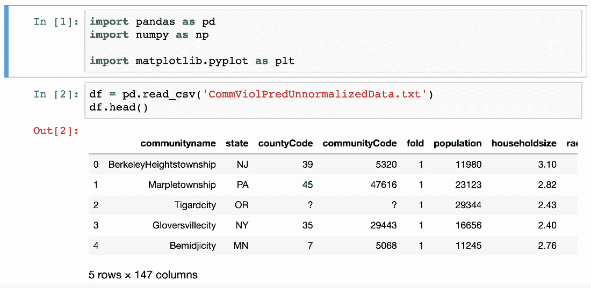

    图 2.21：数据集的前五行

2.  要打印出列名，我们只需在`for`循环中迭代`df.columns`，如下所示：

    ```py
    for column in df.columns:
        print(column)
    ```

3.  可以使用 Python 中的`len()`函数计算数据集中的总列数：

    ```py
    print(len(df.columns))
    ```

4.  要将特殊字符`'?'`替换为`np.nan`对象，可以使用`replace()`方法：

    ```py
    df = df.replace('?', np.nan)
    ```

5.  To print out the list of columns in our dataset and their respective numbers of missing values, we use a combination of the `isnull().sum()` methods:

    ```py
    df.isnull().sum()
    ```

    上述代码应产生以下输出：

    ```py
    communityname             0
    state                     0
    countyCode             1221
    communityCode          1224
    fold                      0
                           ... 
    autoTheftPerPop           3
    arsons                   91
    arsonsPerPop             91
    ViolentCrimesPerPop     221
    nonViolPerPop            97
    Length: 147, dtype: int64
    ```

6.  The numbers of missing values of the two specified columns can be accessed and displayed as follows:

    ```py
    print(df.isnull().sum()['NumStreet'])
    print(df.isnull().sum()['PolicPerPop'])
    ```

    您应该获得`0`和`1872`作为输出。

7.  To compute and visualize the counts of unique values in `'state'` using a bar plot (as well as to adjust the size of the figure), the following code can be used:

    ```py
    state_count = df['state'].value_counts()
    f, ax = plt.subplots(figsize=(15, 10))
    state_count.plot.bar()
    plt.show()
    ```

    这将生成以下图表：

    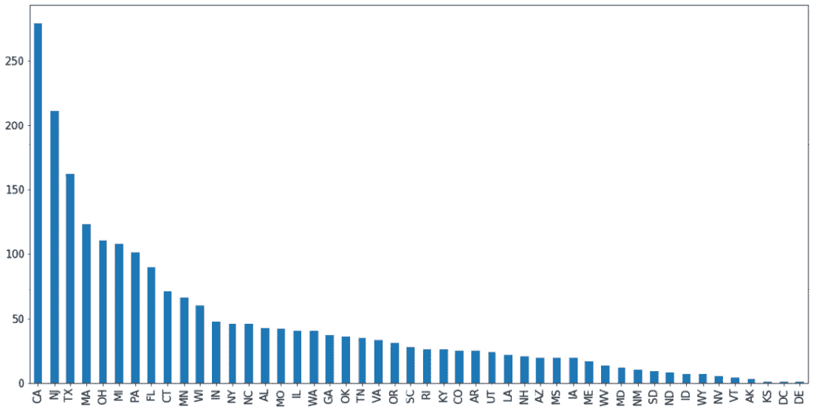

    图 2.22：状态计数条形图

8.  To compute and visualize the same information using a pie chart, the following code can be used:

    ```py
    f, ax = plt.subplots(figsize=(15, 10))
    state_count.plot.pie()
    plt.show()
    ```

    将生成以下可视化：

    

    图 2.23：状态计数饼图

9.  To compute and visualize the population distribution using a histogram, the following code can be used:

    ```py
    f, ax = plt.subplots(figsize=(15, 10))
    df['population'].hist(bins=200)
    plt.show()
    ```

    这将生成以下图表：

    

    图 2.24：人口分布直方图

10.  To compute and visualize the household size distribution using a histogram, the following code can be used:

    ```py
    f, ax = plt.subplots(figsize=(15, 10))
    df['householdsize'].hist(bins=200)
    plt.show()
    ```

    这将生成以下图表：

    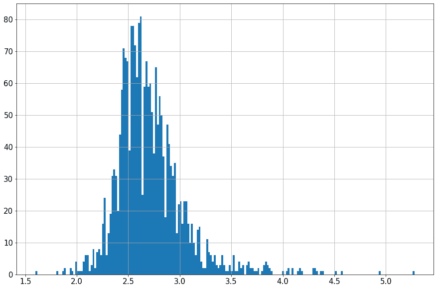

图 2.25：家庭规模分布直方图

笔记

要访问此特定部分的源代码，请参考[https://packt.live/2BB5BJT.](https://packt.live/2BB5BJT )

您也可以在[在线运行此示例 https://packt.live/38nbma9\.](https://packt.live/38nbma9 )

# 3。Python 的统计工具箱

## 活动 3.01：重新访问社区和犯罪数据集

**溶液**

1.  The libraries can be imported, and pandas can be used to read in the dataset as follows:

    ```py
    import pandas as pd
    import numpy as np
    import matplotlib.pyplot as plt
    import seaborn as sns
    df = pd.read_csv('CommViolPredUnnormalizedData.txt')
    df.head()
    ```

    您的输出应如下所示：

    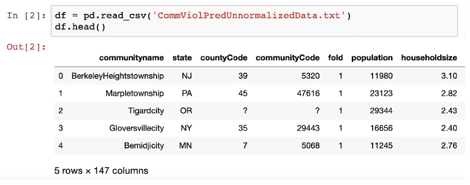

    图 3.29：数据集的前五行

2.  要用`np.nan`对象替换特殊字符，我们可以使用以下代码：

    ```py
    df = df.replace('?', np.nan)
    ```

3.  To compute the actual count for the different age groups, we can simply use the expression `df['population'] * df['agePct...']`, which computes the count in a vectorized way:

    ```py
    age_groups = ['12t21', '12t29', '16t24', '65up']

    for group in age_groups:
        df['ageCnt' + group] = (df['population'] * \
                                df['agePct' + group]).astype(int)
    df[['population'] \
      + ['agePct' + group for group in age_groups] \
      + ['ageCnt' + group for group in age_groups]].head()
    ```

    请注意，我们使用`astype(int)`将最终答案四舍五入为整数。这些新创建的列的前五行应如下所示：

    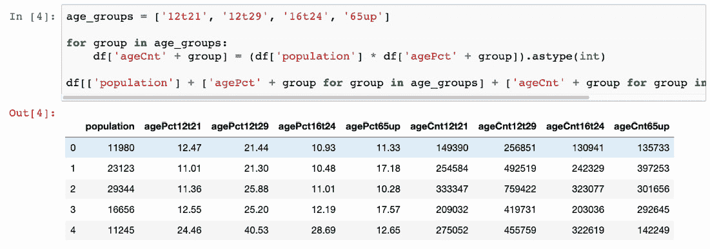

    图 3.30：不同年龄组的实际计数

4.  The expression `df.groupby('state')` gives us a `GroupBy` object that aggregates our dataset into different groups, each corresponding to a unique value in the `'state'` column. Then we can call `sum()` on the object and inspect the columns in question:

    ```py
    group_state_df = df.groupby('state')
    group_state_df.sum()[['ageCnt' + group for group in age_groups]]
    ```

    这应该打印出每个州不同年龄组的计数。此输出的前五列应如下所示：

    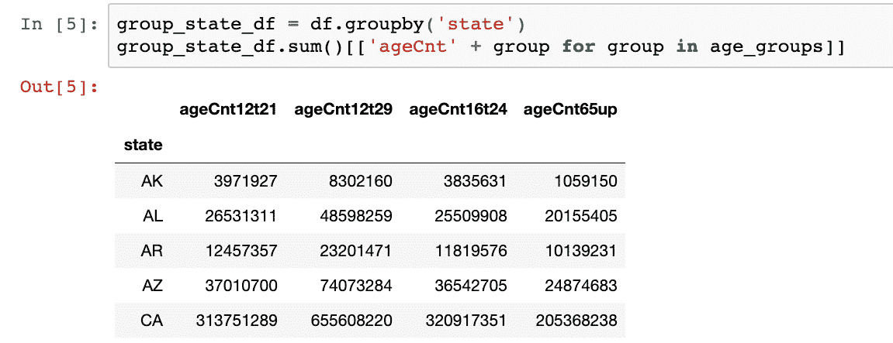

    图 3.31：各州不同年龄组的统计

5.  Using the `df.describe()` method, you can obtain the following output:

    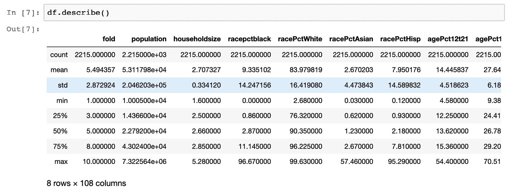

    图 3.32：数据集说明

6.  The boxplots visualizing the count of various crimes can be generated as follows:

    ```py
    crime_df = df[['burglPerPop','larcPerPop',\
                   'autoTheftPerPop', 'arsonsPerPop',\
                   'nonViolPerPop']]
    f, ax = plt.subplots(figsize=(13, 10))
    sns.boxplot(data=crime_df)
    plt.show()
    ```

    这将生成以下图表：

    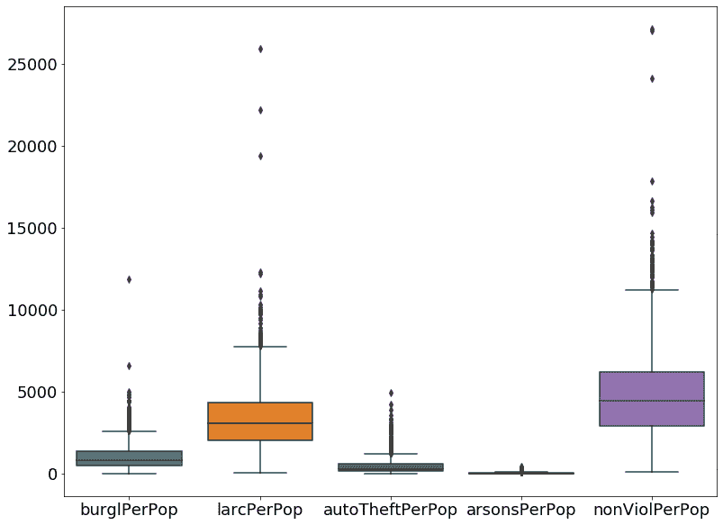

    图 3.33：各种犯罪案件的箱线图

7.  从图表中我们可以看出，非暴力犯罪是五种犯罪中最常见的，而纵火是最不常见的。
8.  A heatmap for the correlation matrix that corresponds to the given columns can be used to visualize the information that was asked for:

    ```py
    feature_columns = ['PctPopUnderPov', 'PctLess9thGrade', \
                       'PctUnemployed', 'ViolentCrimesPerPop', \
                       'nonViolPerPop']
    filtered_df = df[feature_columns]
    f, ax = plt.subplots(figsize=(13, 10))
    sns.heatmap(filtered_df.dropna().astype(float).corr(), \
                                     center=0, annot=True)
    bottom, top = ax.get_ylim()
    ax.set_ylim(bottom + 0.5, top - 0.5)
    plt.show()
    ```

    这将生成以下热图：

    

图 3.34：各种人口特征的热图

从图中可以看出，贫困人口比例与失业人口比例高度相关（`0.77`为相关系数）。这是对各种犯罪相关因素如何相互联系的一个可以理解但又有说服力的见解。

笔记

要访问此特定部分的源代码，请参考[https://packt.live/3f8taZn.](https://packt.live/3f8taZn )

您也可以在[在线运行此示例 https://packt.live/3ikxjeF.](https://packt.live/3ikxjeF )

# 4。Python 函数与代数

## 活动 4.01：多变量盈亏平衡分析

**溶液**：

1.  假设*x*是餐厅每月生产的汉堡数量，*y*是每个汉堡的价格。然后，月收入为*xy*，成本为*6.56x+1312.13*，最终利润总额为两者之差：*xy-6.56x-1312.13*。
2.  To break even, the number of burgers produced, *x*, must be equal to the demand, which gives us the equation: *x = 4000/y*. Furthermore, the total profit should be zero, which leads to *xy - 6.56x = 1312.13*.

    总的来说，我们有以下方程组：

    

    图 4.48：方程组

3.  From the first equation, we can solve for *x = 409.73628*. Plugging this into the second equation, we can solve for *y = 9.76237691*.

    为了用 Python 解决这个系统，我们首先声明变量和常量：

    ```py
    COST_PER_BURGER = 6.56
    FIXED_COST = 1312.13
    AVG_TOWN_BUDGET = 4000
    x = Symbol('x')  # number of burgers to be sold
    y = Symbol('y')  # price of a burger
    ```

    然后我们可以在相应的函数列表中从 SymPy 调用`solve()`函数：

    ```py
    solve([x * (y - COST_PER_BURGER) - FIXED_COST,\
           x * y - AVG_TOWN_BUDGET])
    ```

    此代码应产生以下输出，对应于系统的实际解决方案：

    ```py
    [{x: 409.736280487805, y: 9.76237690066856}]
    ```

4.  该功能最具挑战性的一点是，如果餐厅生产的汉堡数量*x*超过需求*4000/y*，其收入将保持在*4000*。然而，如果汉堡数量少，那么收入是*xy*。因此，我们的函数需要有一个条件来检查此逻辑：

    ```py
    def get_profit(x, y):
        demand = AVG_TOWN_BUDGET / y
        if x > demand:
            return AVG_TOWN_BUDGET - x * COST_PER_BURGER \
                                       - FIXED_COST

        return x * (y - COST_PER_BURGER) - FIXED_COST
    ```

5.  The following code generates the specified lists and the corresponding plot when the price of each burger is $9.76:

    ```py
    xs = [i for i in range(300, 501)]
    profits_976 = [get_profit(x, 9.76) for x in xs]
    plt.plot(xs, profits_976)
    plt.axhline(0, c='k')
    plt.xlabel('Number of burgers produced')
    plt.ylabel('Profit')
    plt.show()
    ```

    输出应如下所示：

    

    图 4.49:9.76 美元价格的盈亏平衡图

    倒置的 V 形利润曲线与`0`处水平线的交点表示分析中的盈亏平衡点，每个汉堡的价格固定在 9.76 美元。该交点的*x*坐标略高于`400`，大致对应*步骤 3*中的盈亏平衡解，此时*x*约为`410`，而*y*约为 9.76。

6.  The following code generates the specified lists and the corresponding plot when the price of each burger is $9.99:

    ```py
    xs = [i for i in range(300, 501)]
    profits_999 = [get_profit(x, 9.99) for x in xs]
    plt.plot(xs, profits_999)
    plt.axhline(0, c='k')
    plt.xlabel('Number of burgers produced')
    plt.ylabel('Profit')
    plt.show()
    ```

    输出应如下所示：

    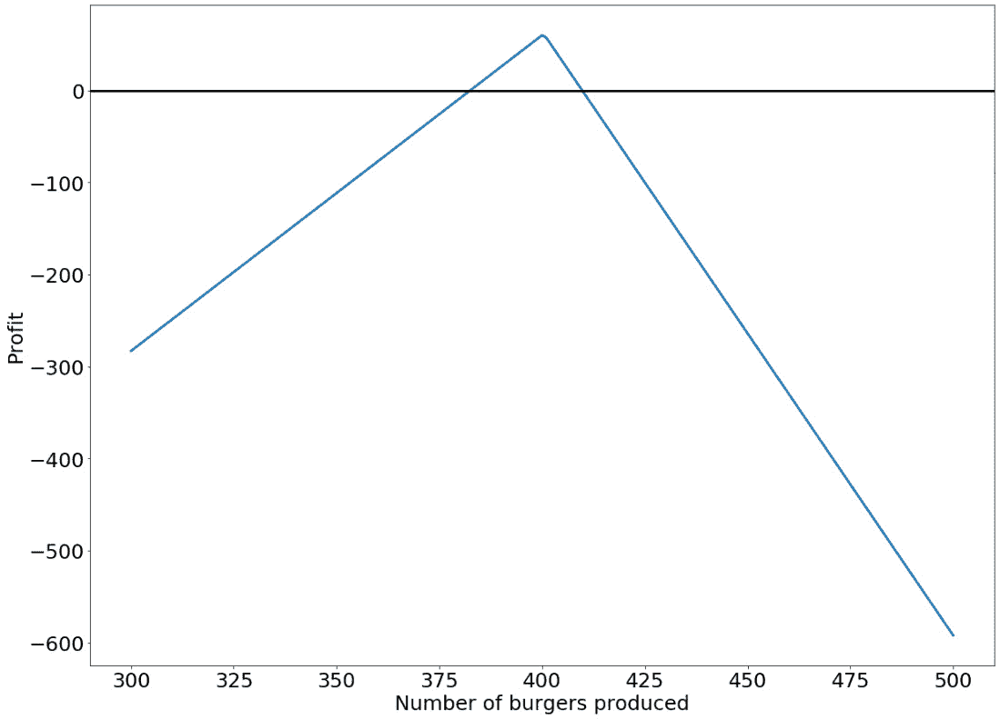

    图 4.50:9.99 美元价格的盈亏平衡图

    类似地，利润曲线的两个交点和`0`处的水平线表示分析中的盈亏平衡点，其中每个汉堡的价格固定在 9.99 美元。

    我们发现，随着汉堡包产量的增加，餐厅的利润呈线性增长。然而，在这个数字满足需求且利润曲线达到峰值后，曲线开始线性下降。这是当餐厅过度生产和增加产品数量不再有益的时候。

7.  The following code generates the specified lists:

    ```py
    xs = [i for i in range(300, 501, 2)]
    ys = np.linspace(5, 10, 100)
    profits = [[get_profit(x, y) for y in ys] for x in xs]
    ```

    `profits`是一个二维列表，其大小相当大，但该列表中的前几个元素应如下所示：

    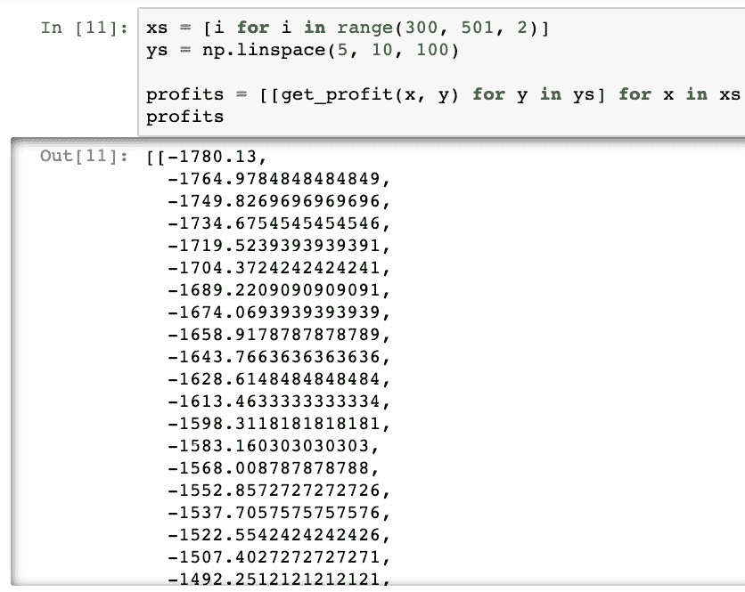

    图 4.51：二维利润表

8.  The specified heatmap can then be generated using the following code:

    ```py
    plt.imshow(profits)
    plt.colorbar()
    plt.xticks([0, 20, 40, 60, 80],\
               [5, 6, 7, 8, 9, 10])
    plt.xlabel('Price for each burger')
    plt.yticks([0, 20, 40, 60, 80],\
               [300, 350, 400, 450, 500])
    plt.ylabel('Number of burgers produced')
    plt.show()
    ```

    输出应如下所示：

    

图 4.52：作为生产和价格函数的利润热图

从图中我们可以看到，*x*和*y*的特定组合控制着餐厅的利润行为。

例如，当每个汉堡的价格较低（地图左侧区域）时，总利润显著低于 0。当我们移到绘图的右侧时，最亮的区域表示将产生最高利润的两个变量的组合。

笔记

要访问此特定部分的源代码，请参考[https://packt.live/2C6dKWz.](https://packt.live/2C6dKWz )

您也可以在[在线运行此示例 https://packt.live/2NTfEwG.](https://packt.live/2NTfEwG )

# 5。更多关于 Python 的数学知识

## 活动 5.01：使用序列计算您的退休计划

**溶液**：

执行以下步骤以完成此活动：

1.  First, we need to identify the input variables and note that the problem boils down to calculating the *n*-term of a geometric sequence with a common ratio (1 + interest) and scale factor for the annual salary.

    `annual_salary`其中的*贡献*是我们对计划的贡献。`current_balance`是我们在第 0 年拥有的资金，应添加到总金额中。`annual_cap`是我们可以贡献的最大百分比；超出该值的任何输入值应等于`contrib_cap`。`annual_salary_increase`告诉我们，我们期望工资每年增加多少。`employer_match`为我们提供了雇主为该计划缴纳的百分比金额（通常在 0.5 到 1 之间）。最后，当前年龄、计划持续时间（以年为单位）、预期寿命（以年为单位）以及计划可能产生的任何其他费用都是输入变量。`per_month`布尔变量确定输出是按每年还是每月的回报金额打印。

2.  Define the first function, `retirement_n`, to calculate the *n*th term of our sequence, which returns the contribution and employer's match as a comma-separated tuple:

    ```py
    def retirement_n(current_balance, annual_salary, \
                     annual_cap, n, contrib, \
                     annual_salary_increase, employer_match, \
                     match_cap, rate):
        '''
        return :: retirement amount at year n
        '''

        annual_salary_n = annual_salary*\
                          (1+annual_salary_increase)**n

        your_contrib = contrib*annual_salary_n
        your_contrib = min(your_contrib, annual_cap)
        employer_contrib = contrib*annual_salary_n*employer_match
        employer_contrib = min(employer_contrib,match_cap\
                               *annual_salary_n*employer_match)

        contrib_total = your_contrib + employer_contrib

        return your_contrib, employer_contrib,         current_balance + contrib_total*(1+rate)**n
    ```

    此处显示的输入是当前余额和年薪的绝对值。我们还将供款、供款上限（即允许的最大值）、年薪增长、雇主匹配和回报率定义为相对值（浮动在 0 和 1 之间）。年度上限也被解读为一个绝对值。

3.  Define the function that will sum up the individual amounts for each year and calculate the total value of our plan. This shall divide this number by the number of years over which the plan is to be used (payback duration) so that the per-year return of the plan is returned by the function. As inputs, it should read the current age, the duration of the plan, and the life expectancy (the duration of the payback is found by subtracting `current_age + plan_years` from `life_expectancy`):

    ```py
    def retirement_total(current_balance, annual_salary, \
        annual_cap=18000, contrib=0.05, \
        annual_salary_increase=0.02, employer_match=0.5, \
        match_cap=0.06, rate=0.03, current_age=35, \
        plan_years=35, life_expectancy=80, fees=0, \
        per_month=False):

        i = 0
        result = 0
        contrib_list = []; ematch_list = []; total_list = []

        while i <= plan_years:
            cn = retirement_n(current_balance=current_balance, \
                 annual_salary=annual_salary, \
                 annual_cap=annual_cap, n=i, \
                 contrib=contrib, match_cap=match_cap, \
                 annual_salary_increase=annual_salary_increase,\
                 employer_match=employer_match, rate=rate)

            contrib_list.append(cn[0])
            ematch_list.append(cn[1]) 
            total_list.append(cn[2])

            result = result + cn[2]
            i+=1
    ```

    前一个函数的主要操作是设置一个循环（`while`迭代），在该循环中调用前一个函数并在每年找到计划的值，*n*（为了简洁起见，我们这里称之为*cn*。结果是所有年份值的总和，并存储在`result`变量中。我们对*cn（cn[0]，cn[1]，cn[2]）*进行切片，因为`retirement_n`函数返回三个量的元组。我们还将贡献值（employee）、匹配值（employee）和合计值存储在三个单独的列表中。这些将从此函数返回。

4.  最后，减去可能需要包含的任何费用并返回结果：

    ```py
        result = result - fees

        years_payback = life_expectancy - (current_age + plan_years)

        if per_month:
            months = 12
        else:
            months = 1
        result = result / (years_payback*months)
        print('You get back:',result)

        return result, contrib_list, ematch_list, total_list
    ```

5.  Check our function and the output:

    ```py
    result, contrib, ematch, total = retirement_total(current_balance=1000, plan_years=35,\
                     current_age=36, annual_salary=40000, \
                     per_month=True)
    ```

    结果如下：

    ```py
    You get back: 3029.952393422356
    ```

6.  Plot your findings. It is always good practice to plot what has been calculated since it helps you digest the main message. Also, the functions can be checked for potential errors:

    ```py
    from matplotlib import pyplot as plt
    years = [i for i in range(len(total))]
    plt.plot(years, total,'-o',color='b')
    width=0.85
    p1 = plt.bar(years, total, width=width)
    p2 = plt.bar(years, contrib, width=width)
    p3 = plt.bar(years, ematch, width=width)
    plt.xlabel('Years')
    plt.ylabel('Return')
    plt.title('Retirement plan evolution')
    plt.legend((p1[0], p2[0], p3[0]), ('Investment returns','Contributions','Employer match'))
    plt.show()
    ```

    绘图将显示如下：

    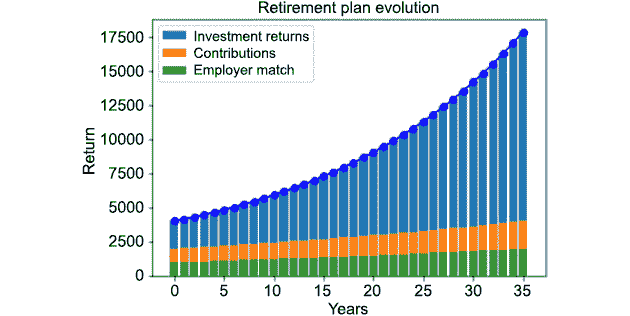

图 5.26：退休计划演变图

基于此，我们创建了一个 Python 程序，该程序根据当前供款和一组其他参数计算退休计划的每月或每年回报。我们已经了解了如何将我们对序列和序列的知识应用到现实生活场景中，以产生有关财务和社会利益的结果。

笔记

要访问此特定部分的源代码，请参考[https://packt.live/2YVgQWE.](https://packt.live/2YVgQWE )

您也可以在[在线运行此示例 https://packt.live/38rOHts.](https://packt.live/38rOHts )

# 6。矩阵与马氏链

## 活动 6.01：使用马尔可夫链构建文本预测

**溶液**：

有几种方法可以解决这个问题，值得一提的是，我们将采用的方法可能是使用文本预测的最简单的方法。在实际操作中，文本预测要复杂得多，并有许多其他因素影响它们，我们将在活动结束时简要介绍这些因素。

1.  We will be using the transcript of the speech given by Winston Churchill at the House of Commons after the soldiers of the Allied forces were rescued from Dunkirk during World War II. The speech by itself is worth a read and can be easily found online if you are interested.

    笔记

    您可以从[下载成绩单 https://packt.live/38rZy6v](https://packt.live/38rZy6v ) 。

2.  This list is stored in a text file named `churchill.txt`. Read through that text file:

    ```py
    # Churchill's speech
    churchill = open('churchill.txt').read()
    keywords = churchill.split()
    print(keywords)
    ```

    我们将其保存在一个名为`churchill`的 string 对象中，然后在 string 中使用`split()`函数标记我们拥有的文本，并将其存储在名为`keywords`的列表中。其结果如下：

    ```py
    ['The', 'position', 'of', 'the', 'B.', 'E.F', 'had',  'now', 'become', 'critical', 'As', 'a', 'result', 'of',  'a', 'most', 'skillfully', 'conducted', 'retreat',….]
    ```

3.  Next, we iterate through the list and append the elements to a new list, which will store the keyword and the word following it:

    ```py
    keylist = []
    for i in range(len(keywords)-1):
        keylist.append( (keywords[i], keywords[i+1]))
    print(keylist)
    ```

    这将产生以下输出：

    ```py
    [('The', 'position'), ('position', 'of'), ('of', 'the'),  ('the', 'B.'), ('B.', 'E.F'), ('E.F', 'had'), ('had',  'now'), ('now', 'become'), ('become', 'critical'),  ('critical', 'As'),….]
    ```

    笔记

    这里的列表已经初始化，是一个元组列表，如果您愿意，可以将其转换为列表，但这不是必需的。

4.  After that, initialize a dictionary, `word_dict`. Once we have the dictionary, we iterate through the preceding `keylist` array and add words to the left in the preceding tuple as keys in the dictionary, and words on the right as values in that dictionary. If the word on the left is already added to the dictionary, we simply append the word on the right to the respective value in the dictionary:

    ```py
    # Create key-value pairs based on follow-up words
    word_dict = {}
    for beginning, following in keylist:
        if beginning in word_dict.keys():
            word_dict[beginning].append(following)
        else:
            word_dict[beginning] = [following]
    print(word_dict)
    ```

    这将产生以下输出：

    ```py
    {'magnetic': ['mines'], 'comparatively': ['slowly'],  'four': ['hundred', 'thousand', 'days', 'or', 'to'],  'saved': ['the', 'not'], 'forget': ['the'],….}
    ```

5.  Having done this, we are now ready to build our predictor. First, we define a NumPy string, which takes a random word as a selection from the preceding set of keywords, and this will be our first word:

    ```py
    first_word = np.random.choice(keywords)
    while first_word.islower():
        first_word = np.random.choice(keywords)
    ```

    前面代码的第二部分旨在确保我们的句子以大写的单词开头。如果我们不太深入地理解自然语言处理是如何工作的，那么如果我们理解原始文本中使用的大写单词将为构建更全面的声明铺平道路，这就足够简单了。我们也可以在这里指定一个特定的词，而不是随机选择它，只要它出现在我们使用的关键词语料库中。

6.  Add this word to a new list:

    ```py
    word_chain = [first_word]
    ```

    这里的第一个单词是使用`random`函数从我们使用的文本文件中的单词库中随机生成的。

    然后，我们将根据之前建立的词典添加其他单词。

7.  Typically, we will be looking at the word we have freshly appended to `word_chain`, beginning with the first word in the list. Use this as the key in the dictionary we have created and follow it randomly with the list of values for that particular key from the dictionary we created previously:

    ```py
    WORDCOUNT = 40
    for i in range(WORDCOUNT):
        word_chain.append(np.random.choice(word_dict[\
                                           word_chain[-1]]))
    ```

    注意我们已经初始化的静态变量`WORDCOUNT`的使用，它指定了我们希望句子的长度。如果您没有广泛使用嵌套 Python 函数的习惯，只需从最里面的函数开始求解，并使用`outer`函数的值即可。

8.  Finally, we will define a string variable called `sentence`, which will be our output:

    ```py
    sentence = ' '.join(word_chain)
    print(sentence)
    ```

    笔记

    因为这里选择的第一个单词和字典中的值都是随机选择的，所以每次我们都会得到不同的输出。

    让我们看看我们将产生的一些输出：

    ```py
    Output 1: 
    British tanks and all the New World, with little or fail. We have been reposed is so plainly marked the fighters which we should the hard and fierce. Suddenly the sharpest form. But this Island home, some articles of all fall
    Output 2
    That expansion had been effectively stamped out. Turning once again there may be very convenient, if necessary to guard their knowledge of the question of His son has given to surrender. He spurned the coast to be held by the right
    Output 3:
    Air Force. Many are a great strength and four days of the British and serious raids, could approach or at least two armored vehicles of the government would observe that has cleared, the fine Belgian Army compelled the retreating British Expeditionary
    Output 4
    30,000 men we can be defended Calais were to cast aside their native land and torpedoes. It was a statement, I feared it was in adverse weather, under its main French Army away; and thus kept open our discussions free, without
    Output 5
    German bombers and to give had the House by views freely expressed in their native land. I thought-and some articles of British and in the rescue and more numerous Air Force, and brain of it be that Herr Hitler has often
    ```

    笔记

    要访问此特定部分的源代码，请参考[https://packt.live/3gr5uQ5\.](https://packt.live/3gr5uQ5 )

    您也可以在[在线运行此示例 https://packt.live/31JeD2b.](https://packt.live/31JeD2b )

# 7。使用 Python 进行基本统计

## 活动 7.01：寻找高评级战略游戏

**溶液**：

1.  按如下方式加载`numpy`和`pandas`库：

    ```py
    import pandas as pd
    import numpy as np
    ```

2.  Load the strategy games dataset (in the `dataset` folder of the chapter):

    ```py
    games = pd.read_csv('../data/appstore_games.csv')
    ```

    笔记

    您可以从 GitHub 存储库[下载数据集 https://packt.live/2O1hv2B](https://packt.live/2O1hv2B) 。

3.  执行我们在本章第一节中所做的所有转换。更改变量名称：

    ```py
    original_colums_dict = {x: x.lower().replace(' ','_') \
                            for x in games.columns}
    games.rename(columns = original_colums_dict,\
                 inplace = True)
    ```

4.  将`'id'`列设置为`index`：

    ```py
    games.set_index(keys = 'id', inplace = True)
    ```

5.  删除`'url`和`'icon_url'`列：

    ```py
    games.drop(columns = ['url', 'icon_url'], \
               inplace = True)
    ```

6.  将`'original_release_date'`和`'current_version_release_date'`更改为`datetime`：

    ```py
    games['original_release_date'] = pd.to_datetime\
                                     (games['original_release_date'])
    games['current_version_release_date'] = \
    pd.to_datetime(games['current_version_release_date'])
    ```

7.  从数据帧

    ```py
    games = games.loc[games['average_user_rating'].notnull()]
    ```

    中删除`'average_user_rating'`为空的行
8.  仅在数据帧中保留`'user_rating_count'`等于或大于`30`：

    ```py
    games = games.loc[games['user_rating_count'] >= 30]
    ```

    的行
9.  打印数据集的维度。您必须有一个包含`4311`行和`15`列的数据帧。您应该得到以下输出：

    ```py
    (4311, 15)
    games.shape
    ```

10.  用字符串`EN`填充`languages`列中缺少的值，以表明这些游戏只有英文版本：

    ```py
    games['languages'] = games['languages'].fillna('EN')
    ```

11.  创建一个名为`free_game`的变量，如果游戏的价格为零，则该变量的值为`free`，如果价格高于零，则该变量的值为`paid`：

    ```py
    games['free_game'] = (games['price'] == 0).astype(int)
                          .map({0:'paid', 1:'free'})
    ```

12.  如果`language`列只有一个语言字符串，则创建一个名为`multilingual`的变量，该变量的值为`monolingual`，如果`language`列至少有两个语言字符串，则创建一个名为`multilingual`的变量：

    ```py
    number_of_languages = games['languages'].str.split(',') \
                                            .apply(lambdax: len(x))
    games['multilingual'] = number_of_languages == 1
    games['multilingual'] = games['multilingual'].astype(int)
                            .map({0:'multilingual', 1:'monolingual'})
    ```

13.  创建一个变量，其中包含上一步创建的两个变量（`free-monolingual`、`free-multilingual`、`paid-monolingual`和`paid-multilingual`）中的四个组合：

    ```py
    games['price_language'] = games['free_game'] + '-' \
                            + games['multilingual']
    ```

14.  Calculate how many observations we have of each type in the `price_language` variable. You should get the following output:

    ```py
    games['price_language'].value_counts()
    ```

    输出结果如下：

    ```py
    free-monolingual     2105
    free-multilingual    1439
    paid-monolingual     467
    paid-multilingual    300
    Name: price_language, dtype: int64
    ```

15.  Use the `groupby` method on the `games` DataFrame, group by the newly created variable, then select the `average_user_rating` variables and calculate the descriptive statistics:

    ```py
    games.groupby('price_language')['average_user_rating']\
                                   .describe()
    ```

    输出结果如下：

    

图 7.35：按价格和语言类别分组的汇总统计数据

笔记

要访问此特定部分的源代码，请参考[https://packt.live/2VBGtJZ.](https://packt.live/2VBGtJZ )

您也可以在[在线运行此示例 https://packt.live/2BwtJNK.](https://packt.live/2BwtJNK )

# 8。基本概率概念及其应用

## 活动 8.01：在金融中使用正态分布

**溶液**：

执行以下步骤以完成此活动：

1.  使用 pandas 从`data`文件夹

    ```py
    import pandas as pd
    import numpy as np
    import scipy.stats as stats
    import matplotlib.pyplot as plt
    %matplotlib inline
    msft = pd.read_csv('../data/MSFT.csv')
    ```

    中读取名为`MSFT.csv`的 CSV 文件
2.  （可选）重命名列，使其易于使用：

    ```py
    msft.rename(columns=lambda x: x.lower().replace(' ', '_'),\
                inplace=True)
    ```

3.  将`date`列转换为合适的`datetime`列：

    ```py
    msft['date'] = pd.to_datetime(msft['date'])
    ```

4.  将`date`列设置为数据帧的索引：

    ```py
    msft.set_index('date', inplace = True)
    ```

5.  在金融学中，股票的日收益率定义为每日收盘价的百分比变化。通过计算`adj close`列的百分比变化，在 MSFT 数据帧中创建`returns`列。使用`pct_change`系列熊猫方法执行此操作：

    ```py
    msft['returns'] = msft['adj_close'].pct_change()
    ```

6.  将分析周期限制在`2014-01-01`至`2018-12-31`（含）

    ```py
    start_date = '2014-01-01'
    end_date = '2018-12-31'
    msft = msft.loc[start_date: end_date]
    ```

    之间
7.  Use a histogram to visualize the distribution of the returns column. Use 40 bins to do so. Does it look like a normal distribution?

    ```py
    msft['returns'].hist(ec='k', bins=40);
    ```

    输出应如下所示：

    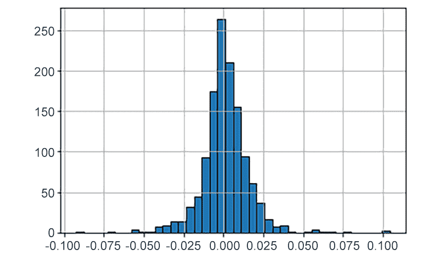

    图 8.24:MSFT 股票收益直方图

8.  Calculate the descriptive statistics of the `returns` column:

    ```py
    msft['returns'].describe()
    ```

    结果如下：

    ```py
    count    1258.000000
    mean        0.000996
    std         0.014591
    min        -0.092534
    25%        -0.005956
    50%         0.000651
    75%         0.007830
    max         0.104522
    Name: returns, dtype: float64
    ```

9.  创建一个名为`R_rv`的随机变量，该变量将表示 MSFT 股票的每日收益*。使用返回列的平均值和标准偏差作为此分布的参数：

    ```py
    R_mean = msft['returns'].mean()
    R_std = msft['returns'].std()
    R_rv = stats.norm(loc = R_mean, scale = R_std)
    ```* 
10.  Plot the distribution of `R_rv` and the histogram of the actual data. Use the `plt.hist()` function with the `density=True` parameter so both the real data and the theoretical distribution appear in the same scale:

    ```py
    fig, ax = plt.subplots()
    ax.hist(x = msft['returns'], ec = 'k', \
            bins = 40, density = True,);
    x_values = np.linspace(msft['returns'].min(), \
                           msft['returns'].max(), num=100)
    densities = R_rv.pdf(x_values)
    ax.plot(x_values, densities, color='r')
    ax.grid();
    ```

    结果如下：

    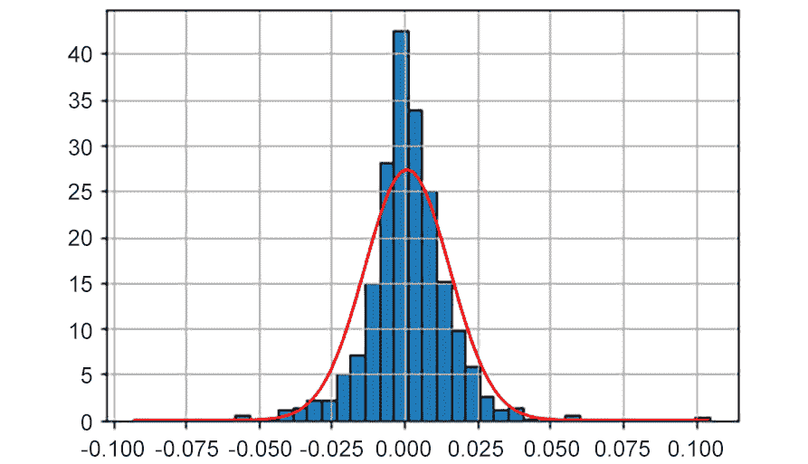

图 8.25:MSFT 股票收益直方图

笔记

要访问此特定部分的源代码，请参考[https://packt.live/2Zw18Ah](https://packt.live/2Zw18Ah) 。

您也可以在[在线运行此示例 https://packt.live/31EmOg9\.](https://packt.live/31EmOg9 )

在看了前面的图之后，你会说正态分布为微软股票的日收益率提供了一个精确的模型吗？

*否。正态分布不能提供关于股票分布的非常精确的近似值，因为理论分布并不完全遵循直方图的一般形状。尽管柱状图相对于中心对称且呈“钟形”，但我们可以清楚地观察到零点附近的值的频率远高于我们在正态分布中预期的频率，这就是为什么我们可以观察到条形图远高于图中心的红色曲线。此外，我们可以观察到许多不太可能出现在正态分布中的极值（左侧和右侧的小条）。*

# 9。用 Python 实现中间统计

## 活动 9.01：标准化测试性能

**溶液**：

1.  We are going to use the t-confidence interval function that we created earlier to calculate a 95% confidence interval. I have recreated it here for completeness:

    ```py
    # We will use the T-Confidence Interval Function 
    # we wrote earlier in the Chapter
    print("For Math:")
    t_confidence_interval(list(data['Math']),0.95)
    print("For Reading:")
    t_confidence_interval(list(data['Reading']),0.95)
    print("For Science:")
    t_confidence_interval(list(data['Science']),0.95)
    ```

    此代码的输出应如下所示：

    ```py
    For Math:
    Your 0.95 t confidence interval is (448.2561338314995,473.6869804542148)
    For Reading:
    Your 0.95 t confidence interval is (449.1937943789569,472.80078847818595)
    For Science:
    Your 0.95 t confidence interval is (453.8991748650865,476.9790108491992)
    ```

    看起来我们可以有 95%的信心说，一个国家的数学平均分数在`448.3`和`473.7`之间，阅读在`449.2`和`472.8`之间，科学在`453.9`和`477.0`之间。

2.  We are going to divide the dataset into two different datasets; one where there are more than `50` internet users per `100` people, and another where there are `50` or fewer internet users per `100` people:

    ```py
    # Using A Hypothesis Test, evaluate whether having 
    # widespread internet infrastructure could have an 
    # impact on scores
    # We need to divide the data set into majority 
    # internet (more than 50 users out of 100) and 
    # minority internet(50 users or less) 
    data1 = data[data['internet_users_per_100'] > 50]
    data0 = data[data['internet_users_per_100'] <= 50]
    print(data1)
    print(data0)
    ```

    这是两个数据集，`data1`和`data0`。请注意，`data1`是如何让我们每 100 人拥有超过 50 名互联网用户，而`data0`每 100 人拥有 50 名或更少互联网用户的所有国家：

    ```py
                  internet_users   Math      Reading   Science
                  _per_100
    Country Code                                                    
    ALB           63.252933        413.1570  405.2588  427.2250
    ARE           90.500000        427.4827  433.5423  436.7311
    ARG           68.043064        409.0333  425.3031  432.2262
    AUS           84.560519        493.8962  502.9006  509.9939
    AUT           83.940142        496.7423  484.8656  495.0375
    ...           ...              ...       ...       ...
    SWE           90.610200        493.9181  500.1556  493.4224
    TTO           69.198471        417.2434  427.2733  424.5905
    TUR           53.744979        420.4540  428.3351  425.4895
    URY           64.600000        417.9919  436.5721  435.3630
    USA           74.554202        469.6285  496.9351  496.2424
    [63 rows x 4 columns]
                  internet_users   Math      Reading   Science
                  _per_100
    Country Code                                                      
    DZA           38.200000        359.6062  349.8593  375.7451
    GEO           47.569760        403.8332  401.2881  411.1315
    IDN           21.976068        386.1096  397.2595  403.0997
    PER           40.900000        386.5606  397.5414  396.6836
    THA           39.316127        415.4638  409.1301  421.3373
    TUN           48.519836        366.8180  361.0555  386.4034
    VNM           43.500000        494.5183  486.7738  524.6445
    ```

3.  Since we are going to compare two samples with likely different variances, we are going to use the 2-sample t-test function from the `scipy.stats` package. Our significance level is going to be 5%. Since we want to test to see whether the internet users' majority mean is higher, this will be an upper-tailed test. This means that we will have to divide our p-value by 2 and only accept the results as significant if the test statistic is positive. The following code will run our test (note—this is a truncated version of the code; the complete code can be found in the GitHub repository):

    ```py
    import scipy.stats as sp
    math_test_results = sp.ttest_ind(data1['Math'],\
                        data0['Math'],equal_var=False)
    print(math_test_results.statistic)
    print(math_test_results.pvalue / 2)
    reading_test_results = sp.ttest_ind(data1['Reading'],\
                           data0['Reading'],equal_var=False)
    print(reading_test_results.statistic)
    print(reading_test_results.pvalue / 2)
    science_test_results = sp.ttest_ind(data1['Science'],\
                           data0['Science'],equal_var=False)
    print(science_test_results.statistic)
    print(science_test_results.pvalue / 2)
    ```

    结果如下：

    ```py
    For Math: (note - statistic must be positive in     order for there to be significance.)
    3.6040958108257897
    0.0036618262642996438
    For Reading: (note - statistic must be positive     in order for there to be significance.)
    3.8196670837378237
    0.0028727977455195778
    For Science: (note - statistic must be positive     in order for there to be significance.)
    2.734488895919944
    0.01425936325938158
    ```

    对于数学、阅读和科学，p 值（第二个数字）小于 0.05，测试统计（第一个数字）为正。这意味着，在所有三项测试中，多数网民组的测试分数显著高于少数网民组。

    笔记

    像这样的结果总是在统计学中提出一句名言：相关性并不意味着因果关系。这意味着，仅仅因为我们发现互联网多数群体的平均分数显著增加，并不意味着互联网导致了分数的增加。第三个未知变量可能会导致差异，称为**潜伏变量**。例如，财富可能是分数和互联网使用率增加的背后原因。

4.  For our final task, we will build a linear regression model that describes mathematics scores in terms of reading and science scores. First, let's extract the scores from our DataFrame and put the mathematics scores in their own DataFrame separate from the reading and science scores. We will use the `LinearRegression` function from `sklearn.linear_model` and assign it to its own variable. Then, we will fit the model using the smaller DataFrames. Finally, we will print the intercept and the coefficients of the regression equation:

    ```py
    #import sklearn linear model package
    import sklearn.linear_model as lm
    # Construct a Linear Model that can predict math 
    #    scores from reading and science scores
    y = data['Math']
    x = data[['Science','Reading']]
    model = lm.LinearRegression()
    model.fit(x,y)
    print(model.coef_)
    print(model.intercept_)
    ```

    结果如下：

    ```py
    [1.02301989 0.0516567 ]
    -38.99549267679242
    ```

    这些系数是按顺序列出的，所以科学是先科学后阅读的。这将使你的等式为：

    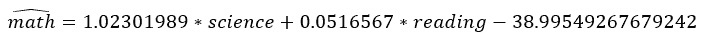

    图 9.23：阅读和科学成绩方面的数学成绩公式

5.  Finally, we will graph the points and the regression and notice that the linear model fits the data well:

    ```py
    import matplotlib.pyplot as plt
    from mpl_toolkits import mplot3d
    import numpy as np
    threedee = plt.figure().gca(projection='3d')
    threedee.scatter(data['Science'], data['Reading'],\
                     data['Math'])
    threedee.set_xlabel('Science Score')
    threedee.set_ylabel('Reading Score')
    threedee.set_zlabel('Math Score')
    xline = np.linspace(0, 600, 600)
    yline = np.linspace(0, 600, 600)
    zline = xline*1.02301989 + \
            yline*0.0516567-38.99549267679242
    threedee.plot3D(xline, yline, zline, 'red')
    plt.show()
    ```

    结果如下：

    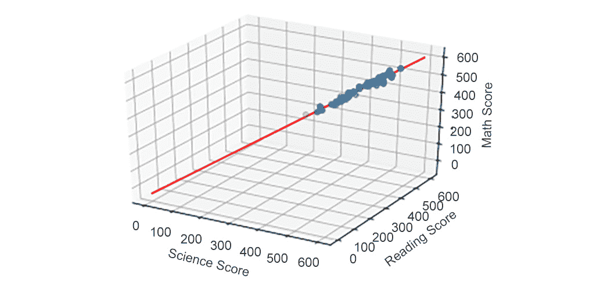

图 9.24：线性方程似乎很适合我们的数据

笔记

要访问此特定部分的源代码，请参考[https://packt.live/3is2GE8\.](https://packt.live/3is2GE8 )

您也可以在[在线运行此示例 https://packt.live/3dWmz2o.](https://packt.live/3dWmz2o )

# 10。Python 基础微积分

## 活动 10.01：最大圆锥体体积

**溶液**：

1.  To find the volume of the resulting cone, you need the height of the cone and the radius of the base, as in the figure on the right of *Figure 10.33*. First, we find the circumference of the base, which is equal to the arc length AB in the cut circle on the left. You can set *R* to `1` since all we're interested in is the angle.

    弧度测量使寻找弧长变得容易。这只是切口留下的角度，即*2π-θ*乘以半径*R*，我们将其设置为`1`。所以*θ*也是圆锥体底部的周长。我们可以建立一个方程并求解*r*：

    

    图 10.34：计算半径的公式

2.  我们将把它编码到我们的程序中。我们需要从 Python 的`math`模块中导入一些东西，并定义`r`变量：

    ```py
    from math import pi,sqrt,degrees
    def v(theta):
        r = (2*pi - theta)/(2*pi) 
    ```

3.  The height of the cone can be found using the Pythagorean theorem, since the hypotenuse, the slant height of the cone, is the radius of the original circle, which we set to `1`:

    

    图 10.35：斜边计算公式

    圆锥体的体积为：

    

    图 10.36：计算圆锥体体积的公式

4.  So, we'll add that to our function:

    ```py
        h = sqrt(1-r**2)
        return (1/3)*pi*r**2*h
    ```

    没那么难吧？这就是我们在使用 Python 时所要做的一切。如果我们用老式的方法进行微积分，我们需要一个体积*V*的表达式，只需要一个变量，*θ*，我们切出的角度。但是我们有一个表示*r*的表达式，表示*θ*，表示*h*的表达式，表示*r*，表示体积的表达式，表示*h*和*r*。我们的程序将几乎在瞬间计算体积。

5.  Now we can run that through our `find_max_mins` function. Theta is measured in radians, so we'll check from `0` to `6.28` and print out the degrees version:

    ```py
    find_max_mins(v,0,6.28)
    ```

    输出结果如下：

    ```py
    Max/Min at x= 1.1529999999999838 y= 0.40306652536733706
    ```

因此，切割原始圆的最佳角度为 1.15 弧度，约为 66 度。

笔记

要访问此特定部分的源代码，请参考[https://packt.live/3iqx6Xj.](https://packt.live/3iqx6Xj )

您也可以在[在线运行此示例 https://packt.live/2VJHIqB.](https://packt.live/2VJHIqB )

# 11。更多的微积分与 Python

## 活动 11.01：寻找曲面的最小值

**溶液**：

1.  我们需要导入`random`模块以使用其`uniform`函数，该函数在给定范围内选择一个随机的十进制值：

    ```py
    import random
    from math import sin, cos,sqrt,pi
    ```

2.  创建一个函数，为我们提供`f`相对于`u`在（`v,w`：

    ```py
    def partial_d(f,u,v,w,num=10000):
        """returns the partial derivative of f
        with respect to u at (v,w)"""
        delta_u = 1/num
        try:
            if u == 'x':
                return (f(v+delta_u,w) - f(v,w))/delta_u
            else:
                return (f(v,w+delta_u) - f(v,w))/delta_u
        except ValueError:
             pass
    ```

    的偏导数
3.  接下来，我们需要一个曲面函数，*x*的范围，*y*的范围，以及一个步长：

    ```py
    def min_of_surface(f,a,b,c,d,step = 0.01):
    ```

4.  我们将调用`random`模块的`uniform`函数，生成一个`x`和一个`y`值作为起点：

    ```py
        x,y = random.uniform(a,b),random.uniform(c,d)
    ```

5.  我们不妨打印出测试的起点。如果我们简单地说`print(x,y,f(x,y))`，我们将得到不必要的长小数，因此我们将在打印时将所有内容四舍五入到*两个*小数位：

    ```py
        print(round(x,2),round(y,2),round(f(x,y),2))
    ```

6.  10000 步可能就足够了。我们也可以用`while True`：

    ```py
        for i in range(100000):
    ```

    使其成为一个无限循环
7.  计算（x，y）处的偏导数：

    ```py
            dz_dx = partial_d(f,'x',x,y, 10000)
            dz_dy = partial_d(f,'y',x,y, 10000)
    ```

8.  如果偏导数都非常接近于 0，这意味着我们已经降到了*z*的最小值。这可能是一个局部最小值，但采取更多的步骤不会让我们在这个随机的起点上有任何进展：

    ```py
            if abs(dz_dx) < 0.001 and abs(dz_dy) < 0.001:
                print("Minimum:", round(x,2),round(y,2),round(f(x,y),2))
                break
    ```

9.  在*x*方向上迈出一小步，与偏导数的值相反。这样，我们总是在*z*值中向下移动。对*y*

    ```py
            x -= dz_dx*step
            y -= dz_dy*step
    ```

    进行同样的操作
10.  如果*x*或*y*超出了我们给出的值范围，则打印`Out of Bounds`并跳出循环：

    ```py
            if x < a or x > b or y < c or y > d:
                print("Out of Bounds")
                break
    ```

11.  最后，打印出我们最终到达的位置的值，以及它的*z*值：

    ```py
        print(round(x,2),round(y,2),round(f(x,y),2))
    ```

12.  Let's test this on a surface that we know the minimum value of: a paraboloid (a 3D parabola), whose minimum value is 0, at the point (0,0). We'll test it for values between -5 and 5\. Here's the equation for the surface:

    

    图 11.48：三维抛物线曲面方程

13.  In Python, it will look like this:

    ```py
    def surface(x,y):
        return x**2 + y**2
    ```

    下面是曲面的外观：

    

    图 11.49：抛物面图形

14.  We chose this one because, similar to its 2D equivalent, the minimum point is at (0,0) and the minimum *z* value is 0\. Let's run the `min_of_surface` function on the paraboloid:

    ```py
    min_of_surface(surface,-5,5,-5,5)
    ```

    结果如下：

    ```py
    -1.55 2.63 9.29
    Minimum: -0.0 0.0 0.0
    ```

    选择的随机点为（-1.55,2.63），其 z 值为 9.29。行走后，它在（0,0）处发现了*最小点，z 值为 0*。如果重新运行代码，它将从另一个随机点开始，但将在（0,0）处结束。

15.  Now that we're confident the `min_of_surface` function works, let's try another surface:

    

    图 11.50：另一个表面的方程式

    我们将使用*-1<x<5*和*-1<y<5*。

16.  First, we redefine the surface function and then run the `min_of_surface` function for the range specified:

    ```py
    def surface(x,y):
        return 3*cos(x)+5*x*cos(x)*cos(y)
    min_of_surface(surface,-1,5,-1,5)
    ```

    输出结果如下：

    ```py
    -0.05 4.07 3.14
    Minimum: 1.1 3.14 -1.13
    ```

    看起来从这个随机点找到的最小点是（1.1,3.14），最小的*z*值是`-1.13`。

17.  当我们重新运行代码以确保一切都正确时，有时我们会收到一条`Out of Bounds`消息，有时我们会得到相同的结果，但重要的是，我们通常会在这一点结束：

    ```py
    3.24 0.92 -12.8
    Minimum: 3.39 0.0 -19.34
    ```

18.  Let's put the `min_of_surface` into a loop so we can run a number of trials:

    ```py
    for i in range(10):
        min_of_surface(surface,-1,5,-1,5)
    ```

    以下是输出：

    ```py
    1.62 4.65 -0.12
    Out of Bounds
    2.87 0.47 -15.24
    Minimum: 3.39 0.0 -19.34
    2.22 0.92 -5.91
    Minimum: 3.39 0.0 -19.34
    -0.78 -0.85 0.32
    Out of Bounds
    1.23 3.81 -0.61
    Minimum: 1.1 3.14 -1.13
    1.96 -0.21 -4.82
    Minimum: 3.39 -0.0 -19.34
    -0.72 3.0 4.93
    Out of Bounds
    2.9 -0.51 -15.23
    Minimum: 3.39 -0.0 -19.34
    1.73 -0.63 -1.58
    Minimum: 3.39 -0.0 -19.34
    2.02 2.7 2.63
    Minimum: 1.1 3.14 -1.13
    ```

每次节目产生一个`Minimum`，这是我们已经看到的两点之一。发生什么事？让我们来看看函数的图：

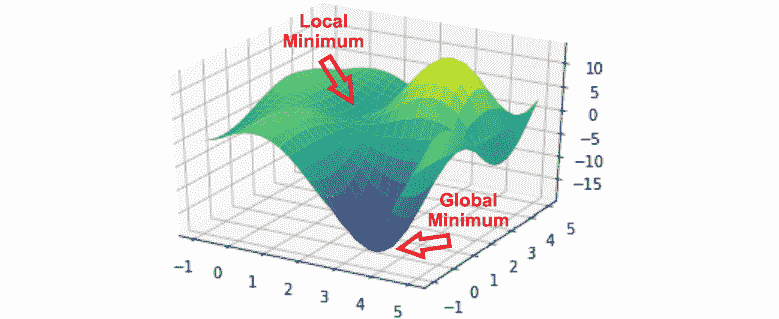

图 11.51的图形

图表显示的是有不止一个最小值。这里有一个全局极小值，函数深入到负数中，还有一个局部极小值，在这个极小值中，*谷*中的任何一点都会下降到点（1.1，3.14）而无法离开。

笔记

要访问此特定部分的源代码，请参考[https://packt.live/2ApkzCc.](https://packt.live/2ApkzCc )

您也可以在[在线运行此示例 https://packt.live/2Avxt1K.](https://packt.live/2Avxt1K )

# 12。用 Python 实现中间演算

## 活动 12.01：寻找粒子的速度和位置

**溶液**：

1.  对于第一部分，我们只需要找到的位置。让我们为*dx/dt*和*dy/dt*：

    ```py
    from math import sqrt,sin,cos,e
    def dx(t):
        return 1 + 3*sin(t**2)
    def dy(t):
        return 15*cos(t**2)*sin(e**t)
    ```

    编写函数
2.  Now, we can loop from 0 to 1.5 and see where *dy/dt* goes from positive to negative or vice versa:

    ```py
    t = 0.0
    while t<=1.5:
        print(t,dy(t))
        t += 0.05
    ```

    以下是输出的重要部分：

    ```py
    1.0000000000000002 3.3291911769931715
    1.0500000000000003 1.8966982923409172
    1.1000000000000003 0.7254255490661741
    1.1500000000000004 -0.06119060343046955
    1.2000000000000004 -0.3474047235245454
    1.2500000000000004 -0.04252527324380706
    1.3000000000000005 0.8982461584089145
    1.3500000000000005 2.4516137491656442
    1.4000000000000006 4.5062509856573225
    1.4500000000000006 6.850332845507693
    ```

    我们可以看到*dy/dt*在 1.1 和 1.15 之间的某个地方为零，同样，在 1.25 和 3 之间，因为这是输出改变符号的地方。

3.  Let's use binary search to narrow down those ranges. This is identical to the previous `bin_search` function except for the `guess =` line. We're simply plugging the average into the `f` function to get our guess:

    ```py
    def bin_search(f,lower,upper,target):
        def average(a,b):
            return (a+b)/2
        for i in range(40):
            avg = average(lower,upper)
            guess = f(avg)
            if guess == target:
                return guess
            if guess < target:
                upper = avg
            else:
                lower = avg
        return avg
    print(bin_search(dy,1.1,1.15,0))
    ```

    答案是`t = 1.145`。

4.  For the other range, you have to change `if guess < target` to `if guess > target` and call the function this way:

    ```py
    print(bin_search(dy,1.25,1.3,0))
    ```

    答案是`t = 1.253`。但那太容易了。目前的挑战是在这些时间内找到粒子的精确*x-y*位置。

5.  我们需要一个`position`函数，它将采取微小的步骤，就像在我们的球问题中：

    ```py
    def position(x0,y0,t):
        """Calculates the height a projectile given the
        initial height and velocity and the elapsed time."""
    ```

6.  首先，我们设置增量变量，并将名为`elapsed`的变量设置为`0`：

    ```py
        inc = 0.001
        elapsed = 0
    ```

7.  我们的初始值`vx`和`vy`将是 0 处的导数，`x`和`y`也将从 0 处开始：

    ```py
        vx,vy = dx(0),dy(0)
        x,y = x0,y0
    ```

8.  现在，我们启动循环并运行它，直到经过的时间达到所需的`t`：

    ```py
        while elapsed <= t:
    ```

9.  我们计算水平和垂直速度，然后增加`x`和`y`，循环计数器：

    ```py
            vx,vy = dx(elapsed),dy(elapsed)
            x += vx*inc
            y += vy*inc
            elapsed += inc
        return x,y
    ```

10.  Now, we'll put the times we found into the `position` function to get the position of the particle at the times we know the derivative is 0:

    ```py
    times = [1.145,1.253]
    for t in times:
        print(t,position(-2,3,t))
    ```

    输出为我们提供了以下信息：

    ```py
    1.145 (0.4740617265786189, 15.338128944560578)
    1.253 (0.9023867438757808, 15.313033269941062)
    ```

    这些是垂直速度为 0 的位置。

11.  For the second part, where we need to find the speed of the particle at *t = 1*, the speed will be the hypotenuse of the right triangle formed by the vertical speed and the horizontal speed:

    ```py
    def speed(t):
        return sqrt(dx(t)**2+dy(t)**2)
    speed(1.0)
    ```

    结果如下：

    ```py
    4.848195599011939
    ```

粒子的速度是每秒 4.85 个单位。

笔记

要访问此特定部分的源代码，请参考[https://packt.live/3dQjSzy.](https://packt.live/3dQjSzy )

您也可以在[在线运行此示例 https://packt.live/3f0IBCE](https://packt.live/3f0IBCE) 。