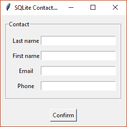
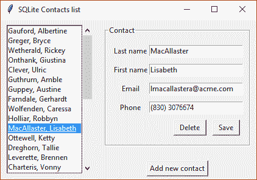

# 面向对象编程与 MVC

在本章中，我们将介绍以下配方：

*   用类构造我们的数据
*   组合小部件以显示信息
*   从 CSV 文件读取记录
*   将数据持久化到 SQLite 数据库中
*   使用 MVC 模式进行重构

# 介绍

到目前为止，我们所有的应用程序都将数据作为局部变量或属性保存在内存中。但是，我们也希望能够持久保存信息，以便在程序关闭时不会丢失信息。

在本章中，我们将讨论如何使用**面向对象编程**（**OOP**原则和应用**模型视图控制器**（**MVC**模式）来表示和显示这些数据。简而言之，该模式提出了三个组件，我们可以将 GUI 划分为三个组件：保存应用程序数据的**模型**、显示该数据的**视图**，以及处理用户事件并将视图与模型连接的**控制器**。

这些概念与我们如何操作和保存信息有关，反过来又帮助我们改进程序的组织。这些方法中的大多数都不是 Tkinter 特有的，您可以将相同的原则应用于其他 GUI 库。

# 用类构造我们的数据

我们将以联系人列表应用程序为例，说明如何使用 Python 类对数据建模。尽管用户界面可能提供许多不同的功能，但我们需要定义在我们的案例中代表我们的域模型的属性，即每个联系人。

# 准备

每个联系人将包含以下信息：

*   名字和姓氏，不能为空
*   电子邮件地址，如`john.doe@acme.com`
*   *（123）4567890*格式的电话号码

有了这个抽象，我们就可以开始编写`Contact`类的代码了。

# 怎么做。。。

首先，我们定义了两个实用程序函数，我们将重用这些函数来验证必填字段或必须遵循特定格式的字段：

```py
def required(value, message):
    if not value:
        raise ValueError(message)
    return value

def matches(value, regex, message):
    if value and not regex.match(value):
        raise ValueError(message)
    return value
```

然后，我们定义了我们的`Contact`类及其`__init__`方法。我们在这里将所有参数设置为相应的字段。我们还将编译后的正则表达式存储为类属性，因为我们将对每个实例使用它们来执行字段验证：

```py
import re

class Contact(object):
    email_regex = re.compile(r"[^@]+@[^@]+\.[^@]+")
    phone_regex = re.compile(r"\([0-9]{3}\)\s[0-9]{7}")

    def __init__(self, last_name, first_name, email, phone):
        self.last_name = last_name
        self.first_name = first_name
        self.email = email
        self.phone = phone
```

但是，此定义不足以强制每个字段的验证。为此，我们使用`@property`装饰器，它允许我们包装对内部属性的访问：

```py
    @property
    def last_name(self):
        return self._last_name

    @last_name.setter
    def last_name(self, value):
        self._last_name = required(value, "Last name is required")
```

同样的技术也适用于`first_name`，因为它也是强制性的。`email`和`phone`属性遵循类似的方法，使用`matches`函数和相应的正则表达式：

```py
    @property
    def email(self):
        return self._email

    @email.setter
    def email(self, value):
        self._email = matches(value, self.email_regex,
                              "Invalid email format")
```

此脚本应另存为`chapter5_01.py`，因为我们将在以后的食谱中使用此名称导入它

# 它是如何工作的。。。

如前所述，`property`描述符是在访问对象属性时触发函数调用的机制。

在我们的示例中，它们使用前导下划线包装对内部属性的访问，如下所示：

```py
contact.first_name = "John" # Stores "John" in contact._first_name
print(contact.first_name)   # Reads "John" from contact._first_name
contact.last_name = ""      # ValueError raised by the required function
```

`property`描述符通常与`@decorated`语法一起使用。记住，修饰函数始终使用相同的名称：

```py
    @property
    def last_name(self):
        # ...

    @last_name.setter
    def last_name(self, value):
        # ...
```

# 还有更多。。。

您可能会发现我们`Contact`类的完整实现非常冗长和重复。对于每个属性，我们需要在`__init__`方法中分配它，并编写相应的 getter 和 setter 方法。

幸运的是，我们有几种方法可以减少样板代码的数量。标准库中的`namedtuple`函数允许我们创建具有命名字段的轻量级元组子类：

```py
from collections import namedtuple

Contact = namedtuple("Contact", ["last_name", "first_name",
                                 "email", "phone"])
```

但是，我们仍然需要添加一个解决方案来实现字段的验证。为了解决这个常见问题，我们可以使用 Python 包索引中提供的`attrs`包

通常，您可以使用以下命令行和`pip`来安装它：

```py
$ pip install attrs
```

安装后，您可以使用`attr.ib`描述符替换所有属性。它还允许您指定一个`validator`回调，该回调接受类实例、要修改的属性和要设置的值。

通过一些小的修改，我们可以重写我们的`Contact`类，将代码行数减少一半：

```py
import re
import attr

def required(message):
    def func(self, attr, val):
        if not val: raise ValueError(message)
    return func

def match(pattern, message):
    regex = re.compile(pattern)
    def func(self, attr, val):
        if val and not regex.match(val):
            raise ValueError(message)
    return func

@attr.s
class Contact(object):
    last_name = attr.ib(validator=required("Last name is required"))
    first_name = attr.ib(validator=required("First name is required"))
    email = attr.ib(validator=match(r"[^@]+@[^@]+\.[^@]+",
                                    "Invalid email format"))
    phone = attr.ib(validator=match(r"\([0-9]{3}\)\s[0-9]{7}",
                                    "Invalid phone format"))
```

在项目中添加外部依赖项时，不仅要注意生产率的好处，还要注意其他重要方面，如文档、支持和许可。

您可以在其网站[上找到有关`attrs`套餐的更多信息 http://www.attrs.org/en/stable/](http://www.attrs.org/en/stable/) 。

# 组合小部件以显示信息

如果所有代码都包含在一个类中，那么很难构建大型应用程序。通过将 GUI 代码拆分为特定的类，我们可以模块化程序结构，并创建具有明确目的的小部件。

# 准备

除了导入 Tkinter 包外，我们还将从前面的配方中导入`Contact`类：

```py
import tkinter as tk
import tkinter.messagebox as mb

from chapter5_01 import Contact
```

验证`chapter5_01.py`文件是否在同一目录中；否则，此`import-from`语句将引发`ImportError`。

# 怎么做。。。

我们将创建一个显示所有联系人的可滚动列表。要将列表中的每个项目表示为字符串，我们将显示联系人的姓和名：

```py
class ContactList(tk.Frame):
    def __init__(self, master, **kwargs):
        super().__init__(master)
        self.lb = tk.Listbox(self, **kwargs)
        scroll = tk.Scrollbar(self, command=self.lb.yview)

        self.lb.config(yscrollcommand=scroll.set)
        scroll.pack(side=tk.RIGHT, fill=tk.Y)
        self.lb.pack(side=tk.LEFT, fill=tk.BOTH, expand=1)

    def insert(self, contact, index=tk.END):
        text = "{}, {}".format(contact.last_name, contact.first_name)
        self.lb.insert(index, text)

    def delete(self, index):
        self.lb.delete(index, index)

    def update(self, contact, index):
        self.delete(index)
        self.insert(contact, index)

    def bind_doble_click(self, callback):
        handler = lambda _: callback(self.lb.curselection()[0])
        self.lb.bind("<Double-Button-1>", handler)
```

为了显示并允许我们编辑联系人的详细信息，我们还将创建一个特定的表单。我们将以`LabelFrame`小部件作为基类，每个字段有一个`Label`和一个`Entry`：

```py
class ContactForm(tk.LabelFrame):
    fields = ("Last name", "First name", "Email", "Phone")

    def __init__(self, master, **kwargs):
        super().__init__(master, text="Contact",
                         padx=10, pady=10, **kwargs)
        self.frame = tk.Frame(self)
        self.entries = list(map(self.create_field, 
        enumerate(self.fields)))
        self.frame.pack()

    def create_field(self, field):
        position, text = field
        label = tk.Label(self.frame, text=text)
        entry = tk.Entry(self.frame, width=25)
        label.grid(row=position, column=0, pady=5)
        entry.grid(row=position, column=1, pady=5)
        return entry

    def load_details(self, contact):
        values = (contact.last_name, contact.first_name,
                  contact.email, contact.phone)
        for entry, value in zip(self.entries, values):
            entry.delete(0, tk.END)
            entry.insert(0, value)

    def get_details(self):
        values = [e.get() for e in self.entries]
        try:
            return Contact(*values)
        except ValueError as e:
            mb.showerror("Validation error", str(e), parent=self)

    def clear(self):
        for entry in self.entries:
            entry.delete(0, tk.END)
```

# 它是如何工作的。。。

`ContactList`类的一个重要细节是，它公开了将回调附加到双击事件的可能性。它还将单击的索引作为参数传递给此函数。我们这样做是因为我们想隐藏底层`Listbox`的实现细节：

```py
    def bind_doble_click(self, callback):
        handler = lambda _: callback(self.lb.curselection()[0])
        self.lb.bind("<Double-Button-1>", handler)
```

`ContactForm`还提供了一个抽象，从条目中输入的值实例化一个新联系人：

```py
    def get_details(self):
        values = [e.get() for e in self.entries]
        try:
            return Contact(*values)
        except ValueError as e:
            mb.showerror("Validation error", str(e), parent=self)
```

由于我们在`Contact`类中包含字段验证，如果条目包含无效值，则实例化新联系人可能会引发`ValueError`。为了通知用户这一点，我们显示了一个带有错误消息的错误对话框。

# 从 CSV 文件读取记录

作为将只读数据加载到应用程序中的第一种方法，我们将使用一个**逗号分隔值**（**CSV**文件）。此格式以纯文本文件的形式将数据制成表格，其中每个文件对应于记录的字段，用逗号分隔，如下所示：

```py
Gauford,Albertine,agauford0@acme.com,(614) 7171720
Greger,Bryce,bgreger1@acme.com,(616) 3543513
Wetherald,Rickey,rwetherald2@acme.com,(379) 3652495
```

对于简单的场景，此解决方案很容易实现，尤其是在文本字段不包含换行符的情况下。我们将使用标准库中的`csv`模块，一旦记录加载到我们的应用程序中，我们将填充在前面的配方中开发的小部件。

# 准备

我们将组装在上一个配方中创建的自定义小部件。从 CSV 文件加载记录后，我们的应用程序将如以下屏幕截图所示：


# 怎么做。。。

除了导入`Contact`类外，我们还将导入`ContactForm`和`ContactList`小部件：

```py
import csv
import tkinter as tk

from chapter5_01 import Contact
from chapter5_02 import ContactForm, ContactList

class App(tk.Tk):
    def __init__(self):
        super().__init__()
        self.title("CSV Contact list")
        self.list = ContactList(self, height=12)
        self.form = ContactForm(self)
        self.contacts = self.load_contacts()

        for contact in self.contacts:
            self.list.insert(contact)
        self.list.pack(side=tk.LEFT, padx=10, pady=10)
        self.form.pack(side=tk.LEFT, padx=10, pady=10)
        self.list.bind_doble_click(self.show_contact)

    def load_contacts(self):
        with open("contacts.csv", encoding="utf-8", newline="") as f:
            return [Contact(*r) for r in csv.reader(f)]

    def show_contact(self, index):
        contact = self.contacts[index]
        self.form.load_details(contact)

if __name__ == "__main__":
    app = App()
    app.mainloop()
```

# 它是如何工作的。。。

`load_contacts`功能负责读取 CSV 文件，并将所有记录转换为`Contact`实例列表。

`csv.reader`读取的每一行都作为字符串元组返回，通过使用逗号分隔符拆分相应的行来创建。由于该元组使用与`Contact`类的`__init__`方法中定义的参数相同的顺序，因此我们可以简单地使用`*`操作符将其解包。此代码可以使用列表理解总结为一行，如下所示：

```py
def load_contacts(self):
    with open("contacts.csv", encoding="utf-8", newline="") as f:
        return [Contact(*r) for r in csv.reader(f)]
```

返回`with`块中的列表没有问题，因为上下文管理器会在方法执行完成时自动关闭文件。

# 将数据持久化到 SQLite 数据库中

因为我们希望能够通过应用程序持久化对数据的更改，所以我们必须实现一个同时用于读写操作的解决方案。

我们可以在每次修改后将所有记录写入读取它们的同一个纯文本文件中，但在单独更新某些记录时，这可能是一个无效的解决方案。

由于所有信息都将存储在本地，因此我们可以使用 SQLite 数据库来持久化应用程序数据。`sqlite3`模块是标准库的一部分，因此开始使用它时不需要任何其他依赖项。

这个方法并不假装是 SQLite 的全面指南，而是将其集成到 Tkinter 应用程序中的实用介绍。

# 准备

在应用程序中使用数据库之前，我们需要创建一些初始数据并将其填充。我们的所有联系人都存储在 CSV 文件中，因此我们将使用迁移脚本读取所有记录并将其插入数据库。

首先，我们创建到`contacts.db`文件的连接，我们的数据将存储在该文件中。然后，我们创建带有`last_name`、`first_name`、`email`和`phone`文本字段的`contacts`表。

由于`csv.reader`返回一个元组的 iterable，其字段的顺序与我们在`CREATE TABLE`语句中定义的顺序相同，因此我们可以将其直接传递给`executemany`方法。它将对每个元组执行`INSERT`语句，用每条记录的实际值替换问号：

```py
import csv
import sqlite3

def main():
    with open("contacts.csv", encoding="utf-8", newline="") as f, \
         sqlite3.connect("contacts.db") as conn:
        conn.execute("""CREATE TABLE contacts (
                          last_name text,
                          first_name text,
                          email text,
                          phone text
                        )""")
        conn.executemany("INSERT INTO contacts VALUES (?,?,?,?)",
                         csv.reader(f))

if __name__ == "__main__":
    main()
```

`with`语句自动提交事务，并在执行结束时关闭文件和 SQLite 连接。

# 怎么做。。。

为了向数据库中添加新联系人，我们将定义一个`Toplevel`子类，该子类重用`ContactForm`来实例化一个新联系人：

```py
class NewContact(tk.Toplevel):
    def __init__(self, parent):
        super().__init__(parent)
        self.contact = None
        self.form = ContactForm(self)
        self.btn_add = tk.Button(self, text="Confirm",
                                 command=self.confirm)
        self.form.pack(padx=10, pady=10)
        self.btn_add.pack(pady=10)

    def confirm(self):
        self.contact = self.form.get_details()
        if self.contact:
            self.destroy()

    def show(self):
        self.grab_set()
        self.wait_window()
        return self.contact
```

以下顶级窗口将显示在主窗口顶部，并在确认或关闭对话框后返回焦点：



我们还将扩展我们的`ContactForm`类，增加两个按钮，一个用于更新联系人信息，另一个用于删除所选联系人：

```py
class UpdateContactForm(ContactForm):
    def __init__(self, master, **kwargs):
        super().__init__(master, **kwargs)
        self.btn_save = tk.Button(self, text="Save")
        self.btn_delete = tk.Button(self, text="Delete")

        self.btn_save.pack(side=tk.RIGHT, ipadx=5, padx=5, pady=5)
        self.btn_delete.pack(side=tk.RIGHT, ipadx=5, padx=5, pady=5)

    def bind_save(self, callback):
        self.btn_save.config(command=callback)

    def bind_delete(self, callback):
        self.btn_delete.config(command=callback)
```

`bind_save`和`bind_delete`方法允许我们将回调附加到相应按钮的`command`。

为了集成所有这些更改，我们将在`App`类中添加以下代码：

```py
class App(tk.Tk):
    def __init__(self, conn):
        super().__init__()
        self.title("SQLite Contacts list")
        self.conn = conn
 self.selection = None
        self.list = ContactList(self, height=15)
        self.form = UpdateContactForm(self)
        self.btn_new = tk.Button(self, text="Add new contact",
 command=self.add_contact)
        self.contacts = self.load_contacts()

        for contact in self.contacts:
            self.list.insert(contact)
        self.list.pack(side=tk.LEFT, padx=10, pady=10)
        self.form.pack(padx=10, pady=10)
        self.btn_new.pack(side=tk.BOTTOM, pady=5)

        self.list.bind_doble_click(self.show_contact)
        self.form.bind_save(self.update_contact)
 self.form.bind_delete(self.delete_contact)
```

我们还需要修改`load_contacts`方法，根据查询结果创建联系人：

```py
    def load_contacts(self):
        contacts = []
        sql = """SELECT rowid, last_name, first_name, email, phone
                 FROM contacts"""
        for row in self.conn.execute(sql):
            contact = Contact(*row[1:])
            contact.rowid = row[0]
            contacts.append(contact)
        return contacts

    def show_contact(self, index):
        self.selection = index
        contact = self.contacts[index]
        self.form.load_details(contact)
```

要将联系人添加到列表中，我们将实例化一个`NewContact`对话框并调用其`show`方法来获取新联系人的详细信息。如果这些值有效，我们将按照`INSERT`语句中指定的顺序将它们存储在元组中：

```py
    def to_values(self, c):
        return (c.last_name, c.first_name, c.email, c.phone)

    def add_contact(self):
        new_contact = NewContact(self)
        contact = new_contact.show()
        if not contact:
            return
        values = self.to_values(contact)
        with self.conn:
            cursor = self.conn.cursor()
            cursor.execute("INSERT INTO contacts VALUES (?,?,?,?)", 
            values)
            contact.rowid = cursor.lastrowid
        self.contacts.append(contact)
        self.list.insert(contact)
```

选择联系人后，我们可以通过检索当前表单值来更新其详细信息。如果它们是有效的，我们执行一个`UPDATE`语句，用指定的`rowid`设置记录的列。

由于此语句的字段与`INSERT`语句的顺序相同，我们重用`to_values`方法从 contact 实例创建元组，唯一的区别是我们必须为`rowid`追加替换参数：

```py
    def update_contact(self):
        if self.selection is None:
            return
        rowid = self.contacts[self.selection].rowid
        contact = self.form.get_details()
        if contact:
            values = self.to_values(contact)
            with self.conn:
                sql = """UPDATE contacts SET
                         last_name = ?,
                         first_name = ?,
                         email = ?,
                         phone = ?
                     WHERE rowid = ?"""
                self.conn.execute(sql, values + (rowid,))
            contact.rowid = rowid
            self.contacts[self.selection] = contact
            self.list.update(contact, self.selection)
```

要删除所选联系人，我们将在`DELETE`语句中使用其`rowid`替换它。提交事务后，通过清除表单并将其从列表中删除，将联系人从 GUI 中删除。`selection`属性也设置为`None`，以避免对无效选择执行操作：

```py
    def delete_contact(self):
        if self.selection is None:
            return
        rowid = self.contacts[self.selection].rowid
        with self.conn:
            self.conn.execute("DELETE FROM contacts WHERE rowid = ?",
                              (rowid,))
        self.form.clear()
        self.list.delete(self.selection)
        self.selection = None
```

最后，我们将把初始化应用程序的代码包装在一个`main`函数中：

```py
def main():
    with sqlite3.connect("contacts.db") as conn:
        app = App(conn)
        app.mainloop()

if __name__ == "__main__":
    main()
```

通过所有这些更改，我们的完整应用程序将如下所示：



# 它是如何工作的。。。

这种类型的应用程序是指使用**CRUD**首字母缩写，它代表**创建、读取、更新和删除**，并且很容易映射到 SQL 语句`INSERT`、`SELECT`、`UPDATE`和`DELETE`。现在我们来看看如何使用`sqlite3.Connection`类实现每个操作。

`INSERT`语句向表中添加新记录，用相应的值指定列名。如果省略列名，将使用列顺序。

在 SQLite 中创建表时，默认情况下，它会添加一个名为`rowid`的列，并自动指定一个唯一的值来标识每一行。由于后续操作通常需要它，我们使用`Cursor`类中可用的`lastrowid`属性检索它：

```py
sql = "INSERT INTO my_table (col1, col2, col3) VALUES (?, ?, ?)"
with connection:
    cursor = connection.cursor()
    cursor.execute(sql, (value1, value2, value3))
    rowid = cursor.lastrowid
```

`SELECT`语句从表的记录中检索一个或多个列的值。我们可以选择添加一个`WHERE`子句来过滤要检索的记录。这对于高效地实现搜索和分页非常有用，但我们将在示例应用程序中省略此功能：

```py
sql = "SELECT rowid, col1, col2, col3 FROM my_table"
for row in connection.execute(sql):
    # do something with row
```

`UPDATE`语句修改表中记录中一列或多列的值。通常，我们在此处添加一个`WHERE`子句来只更新与给定条件匹配的行，如果我们想要更新特定记录，我们可以使用`rowid`：

```py
sql = "UPDATE my_table SET col1 = ?, col2 = ?, col3 = ? 
WHERE rowid = ?"
with connection:
    connection.execute(sql, (value1, value2, value3, rowid))
```

最后，`DELETE`语句从表中删除一条或多条记录。在这些语句中添加`WHERE`子句更为重要，因为如果我们省略它，该语句将删除表中的所有行：

```py
sql = "DELETE FROM my_table WHERE rowid = ?"
with connection:
    connection.execute(sql, (rowid,))
```

# 另见

*   *组合小部件以显示*配方信息

# 使用 MVC 模式进行重构

现在我们已经开发了应用程序的完整功能，我们可以发现当前设计中的一些问题。例如，`App`类有几个职责，从实例化 Tkinter 小部件到执行 SQL 语句。

尽管编写从端到端执行操作的方法似乎简单明了，但这种方法会导致代码库更难维护。我们可以通过预测可能的体系结构更改来检测此缺陷，例如使用通过 HTTP 访问的 REST 后端替换关系数据库。

# 准备

让我们首先定义 MVC 模式，以及它如何映射到我们在前面的配方中构建的应用程序的不同部分。

此模式将我们的应用程序分为三个组件，它们封装了单个职责，形成了 MVC 三元组：

*   **模型**表示域数据，包含与域数据交互的业务规则。在我们的示例中，它是`Contact`类和特定于 SQLite 的代码。
*   **视图**是模型数据的图形表示。在我们的例子中，它是由组成 GUI 的 Tkinter 小部件生成的。
*   **控制器**通过接收用户输入和更新模型数据来连接视图和模型。这对应于我们的回调和事件处理程序以及所需的属性。

我们将重构我们的应用程序以实现这种关注点分离。您将注意到组件之间的交互需要额外的代码，但它们也帮助我们定义它们的边界。

# 怎么做。。。

首先，我们将与数据库交互的所有代码片段提取到一个单独的类中。这将允许我们隐藏持久层的实现细节，只公开四种必要的方法，`get_contacts`、`add_contact`、`update_contact`和`delete_contact`：

```py
class ContactsRepository(object):
    def __init__(self, conn):
        self.conn = conn

    def to_values(self, c):
        return c.last_name, c.first_name, c.email, c.phone

    def get_contacts(self):
        sql = """SELECT rowid, last_name, first_name, email, phone
                 FROM contacts"""
        for row in self.conn.execute(sql):
            contact = Contact(*row[1:])
            contact.rowid = row[0]
            yield contact

    def add_contact(self, contact):
        sql = "INSERT INTO contacts VALUES (?, ?, ?, ?)"
        with self.conn:
            cursor = self.conn.cursor()
            cursor.execute(sql, self.to_values(contact))
            contact.rowid = cursor.lastrowid
        return contact

    def update_contact(self, contact):
        rowid = contact.rowid
        sql = """UPDATE contacts
                 SET last_name = ?, first_name = ?, email = ?, 
                 phone = ?
                 WHERE rowid = ?"""
        with self.conn:
            self.conn.execute(sql, self.to_values(contact) + (rowid,))
        return contact

    def delete_contact(self, contact):
        sql = "DELETE FROM contacts WHERE rowid = ?"
        with self.conn:
            self.conn.execute(sql, (contact.rowid,))
```

这个，连同`Contact`类，将构成我们的模型。

现在，我们的视图将只包含足够的代码来显示 GUI 以及让控制器更新 GUI 的方法。我们还将该类重命名为`ContactsView`，以更好地表达其目的：

```py
class ContactsView(tk.Tk):
    def __init__(self):
        super().__init__()
        self.title("SQLite Contacts list")
        self.list = ContactList(self, height=15)
        self.form = UpdateContactForm(self)
        self.btn_new = tk.Button(self, text="Add new contact")

        self.list.pack(side=tk.LEFT, padx=10, pady=10)
        self.form.pack(padx=10, pady=10)
        self.btn_new.pack(side=tk.BOTTOM, pady=5)

    def set_ctrl(self, ctrl):
        self.btn_new.config(command=ctrl.create_contact)
        self.list.bind_doble_click(ctrl.select_contact)
        self.form.bind_save(ctrl.update_contact)
        self.form.bind_delete(ctrl.delete_contact)

    def add_contact(self, contact):
        self.list.insert(contact)

    def update_contact(self, contact, index):
        self.list.update(contact, index)

    def remove_contact(self, index):
        self.form.clear()
        self.list.delete(index)

    def get_details(self):
        return self.form.get_details()

    def load_details(self, contact):
        self.form.load_details(contact)
```

注意，用户输入由控制器处理，因此我们添加了一个`set_ctrl`方法将其连接到 Tkinter 回调。

我们的`ContactsController`类现在将包含我们初始`App`类中缺失的所有代码，即接口和持久性之间的交互以及`selection`和`contacts`属性：

```py
class ContactsController(object):
    def __init__(self, repo, view):
        self.repo = repo
        self.view = view
        self.selection = None
        self.contacts = list(repo.get_contacts())

    def create_contact(self):
        new_contact = NewContact(self.view).show()
        if new_contact:
            contact = self.repo.add_contact(new_contact)
            self.contacts.append(contact)
            self.view.add_contact(contact)

    def select_contact(self, index):
        self.selection = index
        contact = self.contacts[index]
        self.view.load_details(contact)

    def update_contact(self):
        if not self.selection:
            return
        rowid = self.contacts[self.selection].rowid
        update_contact = self.view.get_details()
        update_contact.rowid = rowid

        contact = self.repo.update_contact(update_contact)
        self.contacts[self.selection] = contact
        self.view.update_contact(contact, self.selection)

    def delete_contact(self):
        if not self.selection:
            return
        contact = self.contacts[self.selection]
        self.repo.delete_contact(contact)
        self.view.remove_contact(self.selection)

    def start(self):
        for c in self.contacts:
            self.view.add_contact(c)
        self.view.mainloop()
```

我们将创建一个`__main__.py`脚本，该脚本不仅允许我们引导应用程序，还允许我们从压缩文件或包含目录的名称启动它：

```py
# Suppose that __main__.py is in the directory chapter5_05
$ python chapter5_05
# Or if we compress the directory contents
$ python chapter5_05.zip
```

# 它是如何工作的。。。

最初的 MVC 实现是用 Smalltalk 编程语言引入的，如下图所示：


在前面的图中，我们可以看到视图将用户事件传递给控制器，控制器反过来更新模型。为了将这些更改传播到视图，模型实现了**观察者模式**。这意味着当更新发生时，订阅模型的视图会收到通知，因此它们可以查询模型状态并更改显示的数据。

在视图和模型之间没有通信的情况下，这种设计有一种变化。相反，控制器在更新模型后对视图进行更改：


这种方法被称为**被动模型**，是现代 MVC 实现中最常见的方法，尤其是对于 web 框架。我们在示例中使用了这种变体，因为它简化了我们的`ContactsRepository`，并且不需要对`ContactsController`类进行重大修改。

# 还有更多。。。

您可能已经注意到，更新和删除操作的工作要归功于`rowid`字段，例如，在`ContactsController`类的`update_contact`方法中：

```py
    def update_contact(self):
        if not self.selection:
            return
        rowid = self.contacts[self.selection].rowid
        update_contact = self.view.get_details()
        update_contact.rowid = rowid
```

因为这是 SQLite 数据库的一个实现细节，所以应该对其他组件隐藏这一细节。

一个解决方案是向`Contact`类添加另一个字段，名称为`id`或`contact_id`——注意`id`也是 Python 内置函数，一些编辑器可能会错误地突出显示它。

然后，我们可以假设该字段作为唯一标识符是域数据的一部分，并将如何生成该字段的实现细节留给模型。