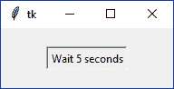
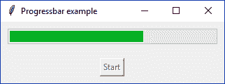
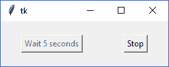

# 六、异步编程

在本章中，我们将介绍以下配方：

*   调度操作
*   在线程上运行方法
*   执行 HTTP 请求
*   使用进度条连接线程
*   取消计划的操作
*   处理空闲任务
*   产生不同的进程

# 介绍

与任何其他编程语言一样，Python 允许您将进程执行划分为多个可以在时间上独立执行的单元，称为**线程**。启动 Python 程序时，它会在**主线程**中开始执行。

Tkinter 的主循环必须从主线程开始，主线程负责处理 GUI 的所有事件和更新。默认情况下，我们的应用程序代码（如回调和事件处理程序）也将在此线程中执行。

但是，如果我们在这个线程中启动一个长时间运行的操作，主线程的执行将被阻止，直到这个操作完成，因此 GUI 将冻结，并且不会响应用户事件。

在本章中，我们将介绍在后台执行单独操作时实现应用程序响应性的几种方法，并了解如何与它们交互。

# 调度操作

在 Tkinter 中防止阻塞主线程的一项基本技术是调度一个将在超时后调用的操作。

在本食谱中，我们将了解如何使用`after()`方法使用 Tkinter 实现这一点，该方法可以从所有 Tkinter 小部件类调用。

# 准备

下面的代码显示了回调如何阻止主循环的简单示例。

此应用程序由一个按钮组成，单击该按钮时该按钮将被禁用，等待 5 秒，然后再次启用。一个简单的实现如下所示：

```py
import time
import tkinter as tk

class App(tk.Tk):
    def __init__(self):
        super().__init__()
        self.button = tk.Button(self, command=self.start_action,
                                text="Wait 5 seconds")
        self.button.pack(padx=20, pady=20)

    def start_action(self):
        self.button.config(state=tk.DISABLED)
        time.sleep(5)
        self.button.config(state=tk.NORMAL)

if __name__ == "__main__":
    app = App()
    app.mainloop()
```

如果您运行前面的程序，您会注意到**等待 5 秒**按钮根本没有被禁用，但点击它会将 GUI 冻结 5 秒。我们可以直接注意到，在按钮样式中，它看起来是活动的，而不是禁用的；此外，标题栏在 5 秒钟后才会响应鼠标单击：



如果我们包含了额外的小部件，比如条目和滚动条，这也会影响它们。

现在我们来看看如何通过调度操作而不是挂起线程执行来实现所需的功能。

# 怎么做。。。

`after()`方法允许您注册一个回调，该回调在 Tkinter 主循环中以毫秒表示的延迟后调用。您可以将这些已注册的报警视为系统空闲时应立即处理的事件。

因此，我们将把对`time.sleep(5)`的调用替换为`self.after(5000, callback)`。我们之所以使用`self`实例，是因为`after()`方法在根`Tk`实例中也可用，从子窗口小部件调用它不会有任何区别：

```py
import tkinter as tk

class App(tk.Tk):
    def __init__(self):
        super().__init__()
        self.button = tk.Button(self, command=self.start_action,
                                text="Wait 5 seconds")
        self.button.pack(padx=50, pady=20)

    def start_action(self):
        self.button.config(state=tk.DISABLED)
        self.after(5000, lambda: self.button.config(state=tk.NORMAL))

if __name__ == "__main__":
    app = App()
    app.mainloop()
```

使用前面的方法，应用程序在调用预定操作之前是有响应的。按钮的外观将变为禁用，我们也可以像往常一样与标题栏交互：


# 它是如何工作的。。。

从上一节提到的示例中，您可能会假设`after()`方法在给定的毫秒持续时间作为延迟传递之后执行回调。

但是，它所做的是请求 Tkinter 注册一个警报，该警报只保证不会在指定时间之前执行；因此，如果主线程很忙，那么实际需要的时间没有上限。

我们还应该记住，在调度操作之后，方法执行会立即继续。以下示例说明了此行为：

```py
print("First")
self.after(1000, lambda: print("Third"))
print("Second")
```

前面的代码片段将分别在 1 秒后打印`"First"`，然后打印`"Second"`，最后打印`"Third"`。在此期间，主线程将保持 GUI 的响应性，用户可以像往常一样与应用程序交互。

通常，我们希望防止同一后台操作多次运行，因此最好禁用触发执行的小部件。

不要忘记任何预定的函数都会在主线程上执行，所以仅仅使用`after()`不足以防止 GUI 冻结；避免将长时间运行的方法作为回调执行也很重要。

在下一个配方中，我们将研究如何在单独的线程中利用这些阻塞操作的执行。

# 还有更多。。。

`after()`方法返回预定报警的标识符，该标识符可传递给`after_cancel()`方法以取消回调的执行。

我们将在另一个配方中看到如何使用此方法实现停止计划回调的功能。

# 另见

*   *取消预定动作*配方

# 在线程上运行方法

因为主线程应该只负责更新 GUI 和处理事件，所以其余的后台操作必须在单独的线程中执行。

Python 的标准库包括`threading`模块，该模块使用高级接口创建和控制多个线程，该接口允许我们使用简单的类和方法。

值得一提的是，参考 Python 实现的 CPython 本质上受到**GIL**（**全局解释器锁**）的限制，这是一种防止多个线程一次执行 Python 字节码的机制，因此，它们不能在单独的内核中运行，以充分利用多处理器系统。如果试图使用`threading`模块来提高应用程序的性能，请记住这一点。

# 怎么做。。。

下面的示例将挂起带有`time.sleep()`的线程与通过`after()`调度的操作相结合：

```py
import time
import threading
import tkinter as tk

class App(tk.Tk):
    def __init__(self):
        super().__init__()
        self.button = tk.Button(self, command=self.start_action,
                                text="Wait 5 seconds")
        self.button.pack(padx=50, pady=20)

    def start_action(self):
        self.button.config(state=tk.DISABLED)
        thread = threading.Thread(target=self.run_action)
        print(threading.main_thread().name)
        print(thread.name)
        thread.start()
        self.check_thread(thread)

    def check_thread(self, thread):
        if thread.is_alive():
            self.after(100, lambda: self.check_thread(thread))
        else:
            self.button.config(state=tk.NORMAL)

    def run_action(self):
        print("Starting long running action...")
        time.sleep(5)
        print("Long running action finished!")

if __name__ == "__main__":
    app = App()
    app.mainloop()
```

# 它是如何工作的。。。

为了创建一个新的`Thread`对象，我们可以使用带有`target`关键字参数的构造函数，当我们调用它的`start()`方法时，它将在一个单独的线程上被调用。

在上一节中，我们在当前应用程序实例上引用了`run_action`方法：

```py
    thread = threading.Thread(target=self.run_action)
    thread.start()
```

然后，我们使用`after()`定期轮询线程状态，再次调度相同的方法，直到线程完成：

```py
    def check_thread(self, thread):
        if thread.is_alive():
            self.after(100, lambda: self.check_thread(thread))
        else:
            self.button.config(state=tk.NORMAL)
```

在前面的代码片段中，我们将延迟设置为`100`毫秒，因为不需要保持比这更频繁的轮询。当然，这个数字可能因线程操作的性质而异。

该时间线可由以下序列图表示：


**线程-1**上的矩形表示它正忙于执行**时间。睡眠（5）**的时间。同时，**主线程**只是定期检查状态，没有足够长的操作时间导致其冻结 GUI。

# 还有更多。。。

在这个食谱中，我们简要介绍了`Thread`类，但指出一些关于在 Python 程序中实例化和使用线程的细节也很重要。

# 线程方法-启动、运行和联接

在我们的示例中，我们调用了`start()`，因为我们希望在单独的线程中执行该方法，并继续执行当前线程。

另一方面，如果我们调用了`join()`方法，主线程将被阻塞，直到新线程终止。因此，即使使用多个线程，它也会导致我们想要避免的相同的“冻结”行为。

最后，`run()`方法是线程实际执行其可调用目标操作的地方。我们将在扩展`Thread`类时覆盖它，就像在下一个配方中一样。

根据经验，始终记住从主线程调用`start()`，以避免阻塞它。

# 参数化目标方法

使用`Thread`类的构造函数时，可以通过`args`参数指定目标方法的参数：

```py
    def start_action(self):
        self.button.config(state=tk.DISABLED)
        thread = threading.Thread(target=self.run_action, args=(5,))
        thread.start()
        self.check_thread(thread)

    def run_action(self, timeout):
        # ...
```

注意，`self`参数是自动传递的，因为我们使用当前实例引用目标方法。在新线程需要从调用方实例访问信息的情况下，这可能很方便。

# 执行 HTTP 请求

通过 HTTP 将应用程序与远程服务器通信是异步编程的常见用例。客户端执行一个请求，该请求使用 TCP/IP 协议通过网络传输；然后，服务器处理信息并将响应发送回客户端。

执行此操作的时间可能从几毫秒到几秒钟不等，但在大多数情况下，可以安全地假设用户可能会注意到此延迟。

# 准备

互联网上有大量的第三方 web 服务，可以免费访问以进行原型设计。但是，我们不希望依赖外部服务，因为它的 API 可能会更改，甚至可能脱机。

对于这个配方，我们将实现我们的自定义 HTTP 服务器，它将生成一个随机 JSON 响应，该响应将打印在单独的 GUI 应用程序上：

```py
import time
import json
import random
from http.server import HTTPServer, BaseHTTPRequestHandler

class RandomRequestHandler(BaseHTTPRequestHandler):
    def do_GET(self):
        # Simulate latency
        time.sleep(3)

        # Write response headers
        self.send_response(200)
        self.send_header('Content-type', 'application/json')
        self.end_headers()

        # Write response body
        body = json.dumps({'random': random.random()})
        self.wfile.write(bytes(body, "utf8"))

def main():
    """Starts the HTTP server on port 8080"""
    server_address = ('', 8080)
    httpd = HTTPServer(server_address, RandomRequestHandler)
    httpd.serve_forever()

if __name__ == "__main__":
    main()
```

要启动此服务器，请运行`server.py`脚本并保持进程运行，以接受本地端口`8080`上的传入 HTTP 请求。

# 怎么做。。。

我们的客户端应用程序包括一个简单的标签，用于向用户显示信息，以及一个按钮，用于向本地服务器执行新的 HTTP 请求：

```py
import json
import threading
import urllib.request
import tkinter as tk

class App(tk.Tk):
    def __init__(self):
        super().__init__()
        self.title("HTTP request example")
        self.label = tk.Label(self,
                              text="Click 'Start' to get a random 
                              value")
        self.button = tk.Button(self, text="Start",
                                command=self.start_action)
        self.label.pack(padx=60, pady=10)
        self.button.pack(pady=10)

    def start_action(self):
        self.button.config(state=tk.DISABLED)
        thread = AsyncAction()
        thread.start()
        self.check_thread(thread)

    def check_thread(self, thread):
        if thread.is_alive():
            self.after(100, lambda: self.check_thread(thread))
        else:
            text = "Random value: {}".format(thread.result)
            self.label.config(text=text)
            self.button.config(state=tk.NORMAL)

class AsyncAction(threading.Thread):
    def run(self):
        self.result = None
        url = "http://localhost:8080"
        with urllib.request.urlopen(url) as f:
            obj = json.loads(f.read().decode("utf-8"))
            self.result = obj["random"]

if __name__ == "__main__":
    app = App()
    app.mainloop()
```

请求完成后，标签显示服务器中生成的随机值，如下所示：


与往常一样，在异步操作运行时禁用该按钮，以避免在处理前一个请求之前执行新请求。

# 它是如何工作的。。。

在这个配方中，我们扩展了`Thread`类，以实现必须使用更面向对象的方法在单独线程中运行的逻辑。这是通过重写其`run()`方法完成的，该方法将负责执行对本地服务器的 HTTP 请求：

```py
class AsyncAction(threading.Thread):
    def run(self):
        # ...
```

有很多 HTTP 客户机库，但这里我们将简单地使用标准库中的`urllib.request`模块。该模块包含`urlopen()`函数，该函数可以获取 URL 字符串并返回 HTTP 响应，该响应可以用作上下文管理器，也就是说，可以使用`with`语句安全地读取和关闭该响应。

服务器返回一个 JSON 文档，如下所示（您可以在浏览器中打开`http://localhost:8080`URL 进行检查）：

```py
{"random": 0.0915826359180778}
```

为了将字符串解码为对象，我们将响应内容从`json`模块传递给`loads()`函数。因此，我们可以像使用字典一样访问随机值，并将其存储在`result`属性中，该属性被初始化为`None`，以防止主线程在发生错误时读取未设置的字段：

```py
def run(self):
    self.result = None
    url = "http://localhost:8080"
    with urllib.request.urlopen(url) as f:
        obj = json.loads(f.read().decode("utf-8"))
        self.result = obj["random"]
```

然后，GUI 会定期轮询线程状态，正如我们在前面的配方中看到的：

```py
    def check_thread(self, thread):
        if thread.is_alive():
            self.after(100, lambda: self.check_thread(thread))
        else:
            text = "Random value: {}".format(thread.result)
            self.label.config(text=text)
            self.button.config(state=tk.NORMAL)
```

这里的主要区别是，一旦线程不活动，我们就可以检索`result`属性的值，因为它是在完成执行之前设置的。

# 另见

*   线程上的*运行方法*配方

# 使用进度条连接线程

进度条是后台任务状态的有用指示器，显示进度条相对于进度的增量填充部分。它们经常用于长时间运行的操作，所以通常将它们与执行这些任务的线程连接起来，以向最终用户提供可视反馈。

# 准备

我们的示例应用程序将包含一个水平进度条，一旦用户单击开始按钮，该进度条将增加固定的进度：



# 怎么做。。。

为了模拟后台任务的执行，将从不同的线程生成进度条的增量，该线程将在每个步骤之间暂停其执行 1 秒。

通信将使用同步队列进行，该队列允许我们以线程安全的方式交换信息：

```py
import time
import queue
import threading
import tkinter as tk
import tkinter.ttk as ttk
import tkinter.messagebox as mb

class App(tk.Tk):
    def __init__(self):
        super().__init__()
        self.title("Progressbar example")
        self.queue = queue.Queue()
        self.progressbar = ttk.Progressbar(self, length=300,
                                           orient=tk.HORIZONTAL)
        self.button = tk.Button(self, text="Start",
                                command=self.start_action)

        self.progressbar.pack(padx=10, pady=10)
        self.button.pack(padx=10, pady=10)

    def start_action(self):
        self.button.config(state=tk.DISABLED)
        thread = AsyncAction(self.queue, 20)
        thread.start()
        self.poll_thread(thread)

    def poll_thread(self, thread):
        self.check_queue()
        if thread.is_alive():
            self.after(100, lambda: self.poll_thread(thread))
        else:
            self.button.config(state=tk.NORMAL)
            mb.showinfo("Done!", "Async action completed")

    def check_queue(self):
        while self.queue.qsize():
            try:
                step = self.queue.get(0)
                self.progressbar.step(step * 100)
            except queue.Empty:
                pass

class AsyncAction(threading.Thread):
    def __init__(self, queue, steps):
        super().__init__()
        self.queue = queue
        self.steps = steps

    def run(self):
        for _ in range(self.steps):
            time.sleep(1)
            self.queue.put(1 / self.steps)

if __name__ == "__main__":
    app = App()
    app.mainloop()
```

# 它是如何工作的。。。

`Progressbar`是包含在`tkinter.ttk`模块中的主题小部件。我们将在[第 8 章](8.html)*主题小部件*中深入探讨此模块，以探索其定义的新小部件，但到目前为止，我们只需要将`Progressbar`用作常规小部件。

我们还需要导入`queue`模块，该模块定义了`Queue`等同步集合。在多线程环境中，同步性是一个重要的主题，因为如果在访问共享资源的同时，我们将这种不太可能但可能的场景定义为**竞争条件**，则可能会出现意外的结果。

通过这些添加，我们的`App`类包含以下新语句：

```py
# ...
import queue
import tkinter.ttk as ttk

class App(tk.Tk):
    def __init__(self):
        # ...
        self.queue = queue.Queue()
 self.progressbar = ttk.Progressbar(self, length=300,
 orient=tk.HORIZONTAL)
```

与前面的示例一样，`start_action()`方法启动一个线程，传递队列和模拟长时间运行任务的步骤数：

```py
    def start_action(self):
        self.button.config(state=tk.DISABLED)
        thread = AsyncAction(self.queue, 20)
        thread.start()
        self.poll_thread(thread)
```

我们的`AsyncAction`子类定义了一个自定义构造函数来接收这些参数，这些参数稍后将在`run()`方法中使用：

```py
class AsyncAction(threading.Thread):
    def __init__(self, queue, steps):
        super().__init__()
        self.queue = queue
        self.steps = steps

    def run(self):
        for _ in range(self.steps):
            time.sleep(1)
            self.queue.put(1 / self.steps)
```

循环暂停线程的执行 1 秒，并将增量添加到队列中的次数与`steps`属性中指示的次数相同。

通过从`check_queue()`读取队列，从应用程序实例中检索添加到队列中的项目：

```py
    def check_queue(self):
        while self.queue.qsize():
            try:
                step = self.queue.get(0)
                self.progressbar.step(step * 100)
            except queue.Empty:
                pass
```

从`poll_thread()`定期调用以下方法，轮询线程状态并使用`after()`再次调度自身，直到线程完成执行：

```py
    def poll_thread(self, thread):
        self.check_queue()
        if thread.is_alive():
            self.after(100, lambda: self.poll_thread(thread))
        else:
            self.button.config(state=tk.NORMAL)
            mb.showinfo("Done!", "Async action completed")
```

# 另见

*   线程上的*运行方法*配方

# 取消计划的操作

Tkinter 的调度机制不仅提供了延迟回调执行的方法，还提供了在回调尚未执行时取消回调的方法。考虑一个可能需要花费太多时间完成的操作，所以我们希望让用户通过按下一个按钮或关闭应用程序来停止它。

# 准备

我们将以第一个配方为例，添加一个停止按钮，以允许我们取消计划的操作。

此按钮仅在计划操作时启用，这意味着一旦单击左侧按钮，用户可以等待 5 秒钟，或者单击停止按钮立即再次启用：



# 怎么做。。。

`after_cancel()`方法通过使用之前通过调用`after()`返回的标识符来取消计划动作的执行。在本例中，该值存储在`scheduled_id`属性中：

```py
import time
import tkinter as tk

class App(tk.Tk):
    def __init__(self):
        super().__init__()
        self.button = tk.Button(self, command=self.start_action,
                                text="Wait 5 seconds")
        self.cancel = tk.Button(self, command=self.cancel_action,
                                text="Stop", state=tk.DISABLED)
        self.button.pack(padx=30, pady=20, side=tk.LEFT)
        self.cancel.pack(padx=30, pady=20, side=tk.LEFT)

    def start_action(self):
        self.button.config(state=tk.DISABLED)
        self.cancel.config(state=tk.NORMAL)
        self.scheduled_id = self.after(5000, self.init_buttons)

    def init_buttons(self):
        self.button.config(state=tk.NORMAL)
        self.cancel.config(state=tk.DISABLED)

    def cancel_action(self):
        print("Canceling scheduled", self.scheduled_id)
        self.after_cancel(self.scheduled_id)
        self.init_buttons()

if __name__ == "__main__":
    app = App()
    app.mainloop()
```

# 它是如何工作的。。。

要取消回调计划，我们首先需要`after()`返回的报警标识符。我们将把这个标识符存储在`scheduled_id`属性中，因为我们需要在一个单独的方法中使用它：

```py
    def start_action(self):
        self.button.config(state=tk.DISABLED)
        self.cancel.config(state=tk.NORMAL)
        self.scheduled_id = self.after(5000, self.init_buttons)
```

然后，该字段在`Stop`按钮的回调中传递给`after_cancel()`：

```py
    def cancel_action(self):
        print("Canceling scheduled", self.scheduled_id)
        self.after_cancel(self.scheduled_id)
        self.init_buttons()
```

在我们的例子中，点击`Start`按钮后禁用它是很重要的，因为如果`start_action()`被调用两次，`scheduled_id`将被覆盖，`Stop`按钮只能取消上一次预定的操作。

作为旁注，`after_cancel()`如果使用已执行的报警标识符调用它，则无效。

# 还有更多。。。

在本节中，我们介绍了如何取消定时报警，但是如果此回调正在轮询后台线程的状态，您可能会想知道如何停止线程。

不幸的是，没有正式的 API 可以优雅地停止`Thread`实例。如果定义了自定义子类，则可能需要在其`run()`方法中包含一个定期检查的标志：

```py
class MyAsyncAction(threading.Thread):
    def __init__(self):
        super().__init__()
        self.do_stop = False

    def run(self):
        # Start execution...
        if not self.do_stop:
            # Continue execution...
```

然后，在调用`after_cancel()`停止线程时，也可以通过设置`thread.do_stop = True`对该标志进行外部修改。

显然，这种方法在很大程度上依赖于`run()`方法内部执行的操作。例如，如果该机制由一个循环组成，则更容易实现，因为您可以在每次迭代之间执行此检查。

从 Python3.4 开始，您可以使用`asyncio`模块，该模块包括用于管理异步操作（包括取消）的类和函数。尽管本模块不在本书的讨论范围内，但如果您面临更复杂的场景，我们建议您探索本模块。

# 处理空闲任务

在某些情况下，操作会导致程序执行过程中出现小停顿。它甚至可能不需要一秒钟就可以完成，但用户仍然可以注意到它，因为它在 GUI 中引入了一个短暂的暂停。

在本食谱中，我们将讨论如何处理这些场景，而不需要在单独的线程中处理整个任务。

# 准备

我们将以*调度动作*配方为例，但超时时间为 1 秒，而不是 5 秒。

# 怎么做。。。

当我们将按钮的状态更改为`DISABLED`时，回调将继续执行，因此直到系统空闲时，按钮的状态才真正改变，这意味着它必须等待`time.sleep()`完成。

但是，我们可以强制 Tkinter 更新所有挂起的 GUI 更新，以便在特定时刻执行，如以下脚本所示：

```py
import time
import tkinter as tk

class App(tk.Tk):
    def __init__(self):
        super().__init__()
        self.button = tk.Button(self, command=self.start_action,
                                text="Wait 1 second")
        self.button.pack(padx=30, pady=20)

    def start_action(self):
        self.button.config(state=tk.DISABLED)
        self.update_idletasks()
        time.sleep(1)
        self.button.config(state=tk.NORMAL)

if __name__ == "__main__":
    app = App()
    app.mainloop()
```

# 它是如何工作的。。。

上一节提到的代码片段的关键是对`self.update_idletasks()`的调用。因此，在调用`time.sleep()`之前，Tkinter 会处理对按钮状态的更改。因此，在回调暂停的第二个过程中，按钮具有所需的外观，而不是`ACTIVE`，这是 Tkinter 在调用回调之前为按钮设置的状态。

我们使用了 AuthT0AL 来说明一个语句需要花费足够长的时间来执行，但是它足够短，可以考虑将其移动到真实世界场景中的一个新线程中，这将是一个更复杂的计算操作。

# 产生不同的进程

在某些情况下，仅仅使用线程是不可能实现应用程序所需的功能的。例如，您可能希望调用一个可以用不同语言编写的单独程序。

在这种情况下，我们还需要使用`subprocess`模块从 Python 进程调用目标程序。

# 准备

以下示例对指定的 DNS 或 IP 地址执行 ping：


# 怎么做。。。

像往常一样，我们定义了一个自定义的`AsyncAction`方法，但在本例中，我们使用 Entry 小部件中设置的值调用`subprocess.run()`。

此函数启动一个单独的子进程，该子进程与线程不同，使用单独的内存空间。这意味着为了获得`ping`命令的结果，我们必须将打印的结果通过管道传输到标准输出，并在 Python 程序中读取：

```py
import threading
import subprocess
import tkinter as tk

class App(tk.Tk):
    def __init__(self):
        super().__init__()
        self.entry = tk.Entry(self)
        self.button = tk.Button(self, text="Ping!",
                                command=self.do_ping)
        self.output = tk.Text(self, width=80, height=15)

        self.entry.grid(row=0, column=0, padx=5, pady=5)
        self.button.grid(row=0, column=1, padx=5, pady=5)
        self.output.grid(row=1, column=0, columnspan=2,
                         padx=5, pady=5)

    def do_ping(self):
        self.button.config(state=tk.DISABLED)
        thread = AsyncAction(self.entry.get())
        thread.start()
        self.poll_thread(thread)

    def poll_thread(self, thread):
        if thread.is_alive():
            self.after(100, lambda: self.poll_thread(thread))
        else:
            self.button.config(state=tk.NORMAL)
            self.output.delete(1.0, tk.END)
            self.output.insert(tk.END, thread.result)

class AsyncAction(threading.Thread):
    def __init__(self, ip):
        super().__init__()
        self.ip = ip

    def run(self):
        self.result = subprocess.run(["ping", self.ip], shell=True,
                                     stdout=subprocess.PIPE).stdout

if __name__ == "__main__":
    app = App()
    app.mainloop()
```

# 它是如何工作的。。。

`run()`函数执行参数数组中指定的子进程。默认情况下，结果只包含进程的返回代码，因此我们还传递带有`PIPE`常量的`stdout`选项，以指示标准输出流应该通过管道传输。

我们调用此函数时，将关键字参数-`shell`-设置为`True`，以避免为`ping`子流程打开新控制台：

```py
    def run(self):
        self.result = subprocess.run(["ping", self.ip], shell=True,
                                     stdout=subprocess.PIPE).stdout
```

最后，当主线程验证此操作已完成时，它将输出打印到文本小部件：

```py
    def poll_thread(self, thread):
        if thread.is_alive():
            self.after(100, lambda: self.poll_thread(thread))
        else:
            self.button.config(state=tk.NORMAL)
 self.output.delete(1.0, tk.END)
 self.output.insert(tk.END, thread.result)
```